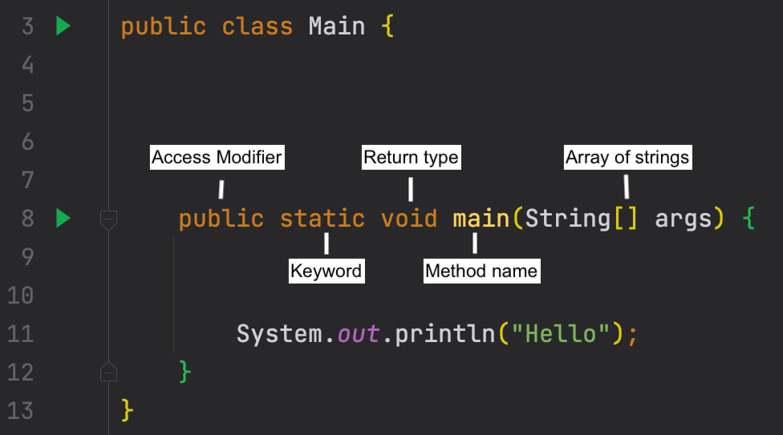
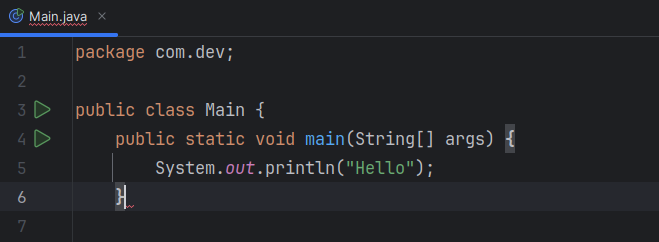
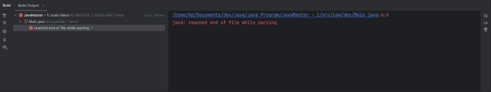
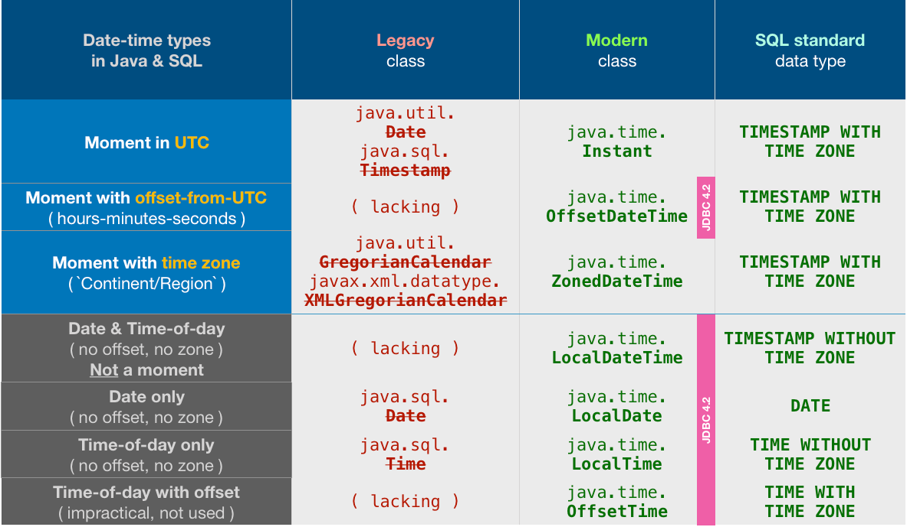

# Course Overview

Our Java Master Class course is the perfect way for anyone who wants to learn Java programming. This comprehensive course will teach you everything you need to know about Java, from the basics of syntax to more advanced concepts like object-oriented programming, data structures, testing, Spring Boot and much more. You'll also get plenty of hands-on experience writing code and working with Java applications. By the end of the course, you'll be confident in your ability to write Java programs and be well on your way to a successful career as a Java programmer.

**Topics coved**

- ✅ History of Java
- ✅ Environment Setup
- ✅ IntelliJ IDEA
- ✅ Java Basics
- ✅ Java Beyond Basics
- ✅ Advanced Java
- ✅ Object Oriented Programming
- ✅ Data Structures
- ✅ Java Generics
- ✅ Java Streams
- ✅ Unit Testing
- ✅ Maven
- ✅ Spring Boot
- ✅ Lots of Exercises

If you're looking to learn Java and become a professional software engineer, our Java Bootcamp course is perfect for you. Java is still one of the most popular programming languages used by thousands of companies around the world, so there is still a huge demand for Java software engineers. With our course, you'll learn everything you need to know about Java programming and become job-ready in no time. So don't wait any longer, sign up for our Java Bootcamp course today!

# Java Overview

## What is Java

Java is a versatile and powerful programming language that enables developers to create robust, high-performance applications and is used in a variety of software development contexts, from enterprise applications to mobile apps and web-based applications.    

The Java platform provides a comprehensive set of libraries and tools that enable developers to create sophisticated applications. Java has a rich set of features that make it an attractive choice for developers, including:

- **Object-oriented**: Java is an object-oriented programming language, which means that it enables developers to create modular, reusable code.
- **Platform independent**: Java code can be run on any platform that supports Java, making it easy to develop cross-platform applications.
- **High performance**: Java is a highly optimized language that enables developers to create efficient applications.
- **Security**: Java has a robust security model that helps to protect against malicious attacks.

Java supports the development of software based on objects and classes, making code more modular and reusable, and simplifying the process of developing complex applications.

Java also supports features like multithreading and sockets, which make it well-suited for developing networked applications. Its extensive libraries provide a wide range of functionality, from GUI components to data structures, making it an ideal choice for developing sophisticated software applications.

## Java Usages

Java is a versatile and powerful programming language that enables developers to create robust, high-performance applications. One of Java's key benefits is its portability—programs written in Java can run on any platform that supports the Java Runtime Environment (JRE). This makes Java an ideal choice for developing cross-platform applications. Additionally, the vast majority of Android apps are written in Java, making it perfect for mobile app development. Java is also widely used in server-side programming, big data processing, and scientific computing. Some of the world's largest companies, including Google, Amazon, and eBay, use Java to power their critical systems, creating strong demand for Java developers skilled in building reliable and scalable applications.

### What is Java used for?

- Server-Side or Backend Application Development
- Full Stack Web Application Development
- Distributed Application Development
- Cloud-Based Application Development
- Big Data Engineering

### What companies use Java?

- Google
- Microsoft
- eBay
- Uber
- Spotify
- Facebook / META
- and many more

## History of Java and Its License

Java was originally developed by James Gosling at Sun Microsystems and released in May 1995 as a core component of Sun Microsystems' Java platform. After Oracle Corporation's acquisition of Sun Microsystems in 2009–10, Java became primarily owned by Oracle.

Early versions of Java were informally known as "Oak" after an oak tree outside Gosling's office. The project was later called "Green" and eventually renamed "Java" after Java coffee, which developers reportedly consumed in large quantities during development.

The original Java compilers, virtual machines, and class libraries were released under proprietary licenses. In 2007, Sun relicensed most Java technologies under the GPL-2.0-only license. Oracle offers its own HotSpot Java Virtual Machine, but the OpenJDK JVM, a free open-source software, is the official reference implementation and the default JVM for almost all Linux distributions.

Java has been on a 6-month rapid-release cycle since Java 10, with new LTS releases every three years starting with Java 11. Java 8 is the last release on the old cycle methodology and is still in active support. For the latest releases, visit [Oracle's Java page](https://www.oracle.com/java/technologies/java-se-glance.html).

Currently, Java is one of the most popular programming languages, especially for server-side web applications, with 9 million developers and a presence on 3 billion devices worldwide.

## Compiled vs Interpreted Languages

A programming language is a formal constructed language designed to communicate instructions to a machine, particularly a computer. Programming languages can be used to create programs that will control the behavior of a machine and/or to express algorithms. Some programming languages are compiled, meaning that they are converted into machine code that can be run on a computer, while others are interpreted, meaning that they are read and executed by a software program. There are many different programming languages in use today, including Java, Golang, C++, and JavaScript. Each programming language has its own unique set of features and syntax rules. Different programming languages are better suited for different tasks. For example, Java is often used for creating complex business applications, while Golang is designed for developing system software. When choosing a programming language for a project, it is important to consider the specific needs of the project and select the language that is best suited for those needs.

**Smalltalk**:- Programming languages can either be compiled, converted into machine code to be directly run on a computer, or interpreted, where they are read and executed by a software program.

### Compiled Languages

Compiled languages are programming languages that are typically converted into machine code before they are run. This machine code can be directly run on the target platform or it can be used to produce an executable file.Compiled languages tend to be faster than interpreted languages because the conversion to machine code happens just once. This means that there is no need to parse and interpret the code every time it is run, as is the case with interpreted languages. In addition, compiled languages often have stricter rules about syntax and semantics, which can result in more reliable and efficient code. However, compiled languages can be more difficult to work with than interpreted languages because errors are usually only detected at compile time, not at runtime. This means that it can be harder to debug compiled code.
Some languages, such as Java, can be either compiled or interpreted, depending on how they are configured.

**Smalltalk**:- Compiled languages are converted into machine code before being run, making them faster than interpreted languages since the conversion happens once. Some languages, like Java, can be either compiled or interpreted, depending on configuration.

### Interpreted Languages

There are two types of programming languages: compiled and interpreted. Compiled languages are translated into machine code, which is then run on a computer. Interpreted languages, on the other hand, are not directly translated into machine code. Instead, they are run through an interpreter, which translates the code into instructions that can be executed by the computer.

One advantage of interpreted languages is that they are usually easier to learn and use than compiled languages. This is because interpreted languages tend to be more high-level, meaning that they are closer to human language and require less detailed instructions than compiled languages. As a result, interpreted languages are often more user-friendly and easier to read and write.

Another advantage of interpreted languages is that they tend to be more portable than compiled languages. This is because an interpreter can be written for multiple platforms, meaning that the same code can run on different types of computers. In contrast, a program written in a compiled language can only run on the type of computer for which it was compiled.

There are some disadvantages to using interpreted languages as well. One drawback is that they tend to be slower than compiled languages because the code must be passed through the interpreter each time it is run. Another disadvantage is that interpreters can be harder to debug than compiled programs because it can be difficult to track down errors in the interpretation process. Overall, though, interpreted languages have some clear advantages that make them worth considering for many programming tasks.

**Smalltalk**:- Interpreted languages are run through an interpreter, making them more portable and user-friendly. However, they tend to be slower than compiled languages as code must be passed through the interpreter each time it is run.

## Static vs Dynamic Type Checking

There are two main approaches to type checking in programming languages: static and dynamic. Static type checking is when types are checked during compilation, before the program is run. This means that any type errors will be caught early on and can be fixed before the program is deployed. Dynamic type checking, on the other hand, happens at runtime. This means that type errors can go undetected until the program is actually being used.

Which approach is better depends on various factors. In general, static type checking can catch more errors and can help to prevent bugs from getting into production code. However, it can also add more of a burden on developers, as they have to make sure that their code is correctly typed before it can be compiled. Dynamic type checking, on the other hand, is usually more flexible and easier to use, but it can lead to more runtime errors.

ultimately, the choice between static and dynamic type checking depends on the specific needs of the programming language and the team developing it.Both approaches have their own advantages and disadvantages, so it's important to choose the one that will work best for the given project.

## Static Type Checking

Static type checking is a process of verifying the correctness of program expressions by inspecting their type declarations. It is usually done at compile-time, but it can also be performed at run-time. Static type checking is an important tool for programming in Java, as it helps to catch errors early and prevent them from propagating throughout the code. In addition, static type checking can also help to improve performance, as the compiler can optimize code that has been verified to be safe. As a result, static type checking is an essential part of programming in Java.

- **Static Type Checking**: Type-checking occurs during compilation, helping catch errors early.

## Dynamic Type Checking

Dynamic type checking is a type of type checking that is performed at run time, as opposed to compile time. It is commonly used in programming languages such as JavaScript and Java. Dynamic type checking can be more flexible than static type checking, as it can allow for values of different types to be passed to a function or method. However, it can also be less efficient, as the program needs to check the types of values at run time. In addition, dynamic type checking can make it more difficult to debug programs, as errors may not be detected until the program is executed.  

- **Dynamic Type Checking**: Type-checking occurs at runtime, allowing flexibility but risking runtime errors.

## Environment Setup

### IDE

An ide, or Integrated Development Environment, is a programming tool that provides a complete set of features for writing, editing and debugging code. Like Microsoft word but for coding. Many ides also include additional features such as a project manager, version control and database integration. While there are a number of different ide options available, some of the most popular include Microsoft Visual Studio, Eclipse and NetBeans. Each ide has its own specific features and capabilities, so it's important to choose one that's well suited to your particular needs. For example, if you're working on large projects with multiple team members, you'll need an ide with built-in collaboration tools. If you're working with languages that are not widely supported, you'll need an ide with good language support. Ultimately, the best ide for you is the one that makes your programming tasks easier and more efficient.

**Smalltalk**:- An Integrated Development Environment (IDE) provides a complete set of features for writing, editing, and debugging code. Popular IDEs for Java include:

- Microsoft Visual Studio
- Eclipse
- NetBeans
- IntelliJ IDEA

### IntelliJ IDEA

IntelliJ is a powerful Java IDE that provides a wide range of features and tools to help you develop applications in an efficient and effective manner. Some of the key features include: code completion, refactoring, static analysis, and debugging. In addition, IntelliJ also features a number of plugins that can further extend its functionality. Whether you're a beginner or an experienced developer, IntelliJ is an excellent choice for developing Java applications.

### Java Development Kit (JDK)

The Java Development Kit (JDK) is a software development environment used for developing Java applications and applets. It includes the Java Runtime Environment (JRE), an interpreter/loader (java), a compiler (javac), an archiver (jar), a documentation generator (javadoc) and other tools needed in Java development. The JDK is freely available from the Oracle website. Oracle also provides a commercial edition of the JDK called the Oracle JDK. It is based on the OpenJDK codebase but includes additional proprietary features. The Oracle JDK is not available for free and must be purchased from Oracle. However, it is still possible to use the Oracle JDK for free by signing up for an Oracle java developers account. This will give you access to download the Oracle JDK and use it for development and testing purposes. Once you have completed your development work, you will need to purchase a license from Oracle in order to redistribute your application.

### OpenJDK

OpenJDK is an open-source implementation of the Java platform. It is the default java development and runtime environment used by many java developers. OpenJDK is developed under the GNU General Public License (GPL). Java applications that are run on OpenJDK are also subject to the terms of the GPL. OpenJDK is supported on a variety of platforms, including Windows, macOS, and Linux. The OpenJDK project was launched in 2006 with the goal of providing a free and open-source java platform. Since then, it has become the most widely used java platform in the world. OpenJDK is maintained by a community of java developers from all over the world. If you're looking for a free and open-source java platform, OpenJDK is a great option.

## Your First Java Program

### Main.java

```java
package com.dev;

public class Main {
    public static void main(String[] args) {
        System.out.println("Hello World");
    }
}
```

Output: `Hello World`


# JVM Compilers Bytecode & Javac

## Java Virtual Machine - JVM

The Java Virtual Machine (JVM) is a virtual machine that enables a computer to run Java programs as well as programs written in other languages that are also compiled to Java bytecode. The JVM is an integral part of the Java platform and ensures that Java applications execute consistently across different platforms.  

The JVM specification defines a minimum set of system requirements that all implementations must meet, such as support for the `java.lang` and `java.util` packages. However, each implementation may also include additional features and functionality.  

For example, the Oracle HotSpot JVM includes features such as Just-In-Time compilation and Ahead-Of-Time compilation. The JVM is often used interchangeably with the term "Java Runtime Environment" (JRE), which is a software package that contains everything needed to run a Java program, including the JVM.

However, it is worth noting that the JRE does not include development tools such as compilers and debuggers. Therefore, developers typically use the term "JDK" (Java Development Kit) to refer to a complete set of tools for developing Java applications.

## Popular JVM Languages

- Java
- Kotlin
- Groovy
- Scala
- Closure

## Java Bytecode

Java bytecode is the instruction set of the Java Virtual Machine (JVM). It is a platform-independent code that runs on any Java-enabled platform. Bytecode is generated from high-level source languages like Java. The java compiler converts java source code into bytecode and the JVM executes it.  

Bytecode is a compact code and is easy to interpret. It can be executed directly by a JVM or can be translated into native machine code for faster execution. Bytecode instructions are simple and small in size which makes them suitable for interpretation. The bytecodes are easily managed and updated as they are platform-independent.

The Java bytecode provides portability and security as the code cannot be easily understood by humans. Java bytecode can be run on any system that has a JVM installed without recompilation. The Java bytecode also provides security as it is difficult to reverse engineer Java programs. The Java bytecode files have a `.class` extension and can be executed by the JVM.

## What is a Compiler

In computing, a compiler is a computer program that translates computer code written in one programming language into another language. The most common reason for wanting to do this is to create an executable program that can run on a different type of computer. For example, a person might write a program in Java and then use a compiler to create an executable program that can run on a Windows PC. Some programming languages are more difficult to compile than others.  

Languages like C and C++, which are lower-level languages, are generally easier to compile than higher-level languages like Java. This is because lower-level languages provide the compiler with more specific instructions about how to translate the code. As a result, compilers for lower-level languages tend to be more reliable and produce better results. In general, however, most programming languages can be compiled using one or more available compilers.

## Javac

Javac is the Java compiler, which compiles Java source code into Java bytecode. The Java compiler is invoked with the `javac` command. Javac converts Java source code into Java bytecodes, which can then be executed by the Java Virtual Machine. Javac is included in the Java Development Kit (JDK). The Java compiler is also available as part of the OpenJDK project.  

Java and Javac are two different things but are very closely related. Java is a high-level programming language while Javac is a compiler that turns Java code into something that can be read and executed by a computer. Without Javac, your computer would not be able to understand any Java code that you wrote. Both Java and Javac are essential for anyone wanting to do any sort of programming in Java.

## Compiling through Terminal With Javac

To compile and run the following Java program via the terminal, we first need to compile it.

**Main.java**

```java
package com.dev; 

public class Main { 
    public static void main(String[] args) { 
        System.out.println("Hello"); 
    } 
}
```

## Command

- bash

    ```command
    javac filename [options]
    ```

### Under /Users/dev/IdeaProjects/java/src/main/java

- bash

    ```Command
    javac com/dev/Main.java
    ```

The above command produces the class called `Main.class` containing the following ByteCode:

```Java
// class version 61.0 (61) 
// access flags 0x21 
public class com/dev/Main { 

  // compiled from: Main.java 

  // access flags 0x1 
  public <init>()V 
   L0 
    LINENUMBER 3 L0 
    ALOAD 0 
    INVOKESPECIAL java/lang/Object.<init> ()V 
    RETURN 
   L1 
    LOCALVARIABLE this Lcom/dev/Main; L0 L1 0 
    MAXSTACK = 1 
    MAXLOCALS = 1 

  // access flags 0x9 
  public static main([Ljava/lang/String;)V 
    // parameter  args 
   L0 
    LINENUMBER 5 L0 
    GETSTATIC java/lang/System.out : Ljava/io/PrintStream; 
    LDC "Hello" 
    INVOKEVIRTUAL java/io/PrintStream.println (Ljava/lang/String;)V 
   L1 
    LINENUMBER 6 L1 
    RETURN 
   L2 
    LOCALVARIABLE args [Ljava/lang/String; L0 L2 0 
    MAXSTACK = 2 
    MAXLOCALS = 1 
} 
```

#### The above code is that is fed into the JVM for execution

- Now we can run the application with java using the following command

    ```command
    java com.dev.Main
    ```

- **output**:

    ```output
    Hello
    ```

`IntelliJ` will compile and run any Main class, so no need to compile manually with javac and run with java commands.

This is the command `IntelliJ` uses behind the scenes. It might be slightly different for you.

```command
/Users/dev/Library/Java/JavaVirtualMachines/openjdk-17.0.1/Contents/Home/bin/java -javaagent:/Users/dev/Library/Application Support/JetBrains/Toolbox/apps/IDEA-C/ch-0/221.6008.13/IntelliJ IDEA CE.app/Contents/lib/idea_rt.jar=53086:/Users/dev/Library/Application Support/JetBrains/Toolbox/apps/IDEA-C/ch-0/221.6008.13/IntelliJ IDEA CE.app/Contents/bin -Dfile.encoding=UTF-8 -classpath /Users/dev/IdeaProjects/java/target/classes:/Users/dev/.m2/repository/org/springframework/boot/spring-boot-starter-web/2.7.1/spring-boot-starter-web-2.7.1.jar:/Users/dev/.m2/repository/org/springframework/boot/spring-boot-starter/2.7.1/spring-boot-starter-2.7.1.jar:/Users/dev/.m2/repository/org/springframework/boot/spring-boot/2.7.1/spring-boot-2.7.1.jar:/Users/dev/.m2/repository/org/springframework/boot/spring-boot-autoconfigure/2.7.1/spring-boot-autoconfigure-2.7.1.jar:/Users/dev/.m2/repository/org/springframework/boot/spring-boot-starter-logging/2.7.1/spring-boot-starter-logging-2.7.1.jar:/Users/dev/.m2/repository/ch/qos/logback/logback-classic/1.2.11/logback-classic-1.2.11.jar:/Users/dev/.m2/repository/ch/qos/logback/logback-core/1.2.11/logback-core-1.2.11.jar:/Users/dev/.m2/repository/org/slf4j/slf4j-api/1.7.36/slf4j-api-1.7.36.jar:/Users/dev/.m2/repository/org/apache/logging/log4j/log4j-to-slf4j/2.17.2/log4j-to-slf4j-2.17.2.jar:/Users/dev/.m2/repository/org/apache/logging/log4j/log4j-api/2.17.2/log4j-api-2.17.2.jar:/Users/dev/.m2/repository/org/slf4j/jul-to-slf4j/1.7.36/jul-to-slf4j-1.7.36.jar:/Users/dev/.m2/repository/jakarta/annotation/jakarta.annotation-api/1.3.5/jakarta.annotation-api-1.3.5.jar:/Users/dev/.m2/repository/org/springframework/spring-core/5.3.21/spring-core-5.3.21.jar:/Users/dev/.m2/repository/org/springframework/spring-jcl/5.3.21/spring-jcl-5.3.21.jar:/Users/dev/.m2/repository/org/yaml/snakeyaml/1.30/snakeyaml-1.30.jar:/Users/dev/.m2/repository/org/springframework/boot/spring-boot-starter-json/2.7.1/spring-boot-starter-json-2.7.1.jar:/Users/dev/.m2/repository/com/fasterxml/jackson/core/jackson-databind/2.13.3/jackson-databind-2.13.3.jar:/Users/dev/.m2/repository/com/fasterxml/jackson/core/jackson-annotations/2.13.3/jackson-annotations-2.13.3.jar:/Users/dev/.m2/repository/com/fasterxml/jackson/core/jackson-core/2.13.3/jackson-core-2.13.3.jar:/Users/dev/.m2/repository/com/fasterxml/jackson/datatype/jackson-datatype-jdk8/2.13.3/jackson-datatype-jdk8-2.13.3.jar:/Users/dev/.m2/repository/com/fasterxml/jackson/datatype/jackson-datatype-jsr310/2.13.3/jackson-datatype-jsr310-2.13.3.jar:/Users/dev/.m2/repository/com/fasterxml/jackson/module/jackson-module-parameter-names/2.13.3/jackson-module-parameter-names-2.13.3.jar:/Users/dev/.m2/repository/org/springframework/boot/spring-boot-starter-tomcat/2.7.1/spring-boot-starter-tomcat-2.7.1.jar:/Users/dev/.m2/repository/org/apache/tomcat/embed/tomcat-embed-core/9.0.64/tomcat-embed-core-9.0.64.jar:/Users/dev/.m2/repository/org/apache/tomcat/embed/tomcat-embed-el/9.0.64/tomcat-embed-el-9.0.64.jar:/Users/dev/.m2/repository/org/apache/tomcat/embed/tomcat-embed-websocket/9.0.64/tomcat-embed-websocket-9.0.64.jar:/Users/dev/.m2/repository/org/springframework/spring-web/5.3.21/spring-web-5.3.21.jar:/Users/dev/.m2/repository/org/springframework/spring-beans/5.3.21/spring-beans-5.3.21.jar:/Users/dev/.m2/repository/org/springframework/spring-webmvc/5.3.21/spring-webmvc-5.3.21.jar:/Users/dev/.m2/repository/org/springframework/spring-aop/5.3.21/spring-aop-5.3.21.jar:/Users/dev/.m2/repository/org/springframework/spring-context/5.3.21/spring-context-5.3.21.jar:/Users/dev/.m2/repository/org/springframework/spring-expression/5.3.21/spring-expression-5.3.21.jar:/Users/dev/.m2/repository/com/github/javafaker/javafaker/1.0.2/javafaker-1.0.2.jar:/Users/dev/.m2/repository/org/apache/commons/commons-lang3/3.12.0/commons-lang3-3.12.0.jar:/Users/dev/.m2/repository/org/yaml/snakeyaml/1.23/snakeyaml-1.23-android.jar:/Users/dev/.m2/repository/com/github/mifmif/generex/1.0.2/generex-1.0.2.jar:/Users/dev/.m2/repository/dk/brics/automaton/automaton/1.11-8/automaton-1.11-8.jar com.dev.Main
```

## What are Compile Errors

A compile error occurs when a computer program cannot understand a line of code. This can be due to a typo, an incorrect character, or an incorrect syntax. When this happens, the program will usually produce an error message that can help you to identify the problem. Fixing a compile error is usually a simple matter of correcting the offending line of code. However, if the error is not immediately apparent, it can be helpful to use a debugging tool to track down the source of the problem.

Debugging tools can provide detailed information about the state of a program at the time an error occurs, which can make it much easier to identify and fix the problem.

In order to run any java program it must be free of compile errors unlike dynamic type languages such as Javascript, Python etc.

# Public Static Void Main

Let's take a close look at the main method.

The main method is a key component of every Java program. The main method is what tells the Java Runtime Environment where to start executing the code in a Java program. Every Java program must have a main method with the signature `public static void main(String[] args)`. The Java main method is typically the first method called when a Java program is executed. The main method can be used to initialize variables, set up data structures, and perform other tasks that are necessary for the program to run correctly. Without the `main()` method, the JVM will not execute the program. In short, the main method is essential for every Java program.

## Syntax



### Main Method

- **public** - The method is accessible from outside of the class you are currently in. This is necessary because this method is being called by the Java runtime system which is not located in your current class.
- **static** - When the JVM makes a call to the main method, there is no object existing for the class being called; therefore, it has to have a static method to allow invocation from the class.
- **void** - The return type. `void` means that this method has no return value.
- **main** - Method name and it is fixed. It's called by the JVM as the entry point for an application.
- **String args[]** - Command line arguments of type String that your Java application accepts when you run it.

# Understanding Java Code

As a programmer, it is important to have a strong understanding of the syntax of the language you are working in. This will help you to correctly write code that achieves the desired outcome. When it comes to Java, there are a few key things to keep in mind. First, every line of code must end with a semicolon. Second, Java is a case-sensitive language, which means that you need to be careful about how you use upper and lower case letters. Finally, indentation is important for readability and can affect the output of your code. By taking the time to understand Java syntax, you can avoid common mistakes and write code that is more likely to be successful.

## Let's take the above working Java code

### Main.java

```java
public class Main {
    public static void main(String[] args) {
        System.out.println("Hello World");
    }
}
```

If we remove the semicolon `;` at the end of `line 3`, we will get a compilation error saying the following: `java: ';' expected.`

The same, if we remove the ending `}` curly bracket for the opening of `line 10 {`, we get the following compilation error: `java: reached end of file while parsing.`




IntelliJ IDEA is great at highlighting all kinds of errors, including compile errors. If your code fails to compile read and fix all error presented by IntelliJ IDEA until you get a successful compilation.

# The Basics

# Reserved Keywords

In Java, there is a set of reserved keywords which have specific meanings and cannot be used as identifiers in programs. These keywords are primarily used to control the flow of execution in Java programs. Some of the most important keywords are: `public`, `static`, `void`, `if`, `else`, etc. Each keyword has a specific meaning and is used in a specific context. For example, the `public` keyword is used to specify that a method or variable is accessible from outside the class in which it is declared. On the other hand, the `static` keyword is used to specify that a method or variable belongs to the class, rather than to an instance of the class. Similarly, the `void` keyword is used to specify that a method does not return any value. Hence, it is important to be familiar with the meaning and use of Java reserved keywords.

## List of Reserved Keywords

| **Keyword**  | **Description**                                                                                                                                  |
|--------------|---------------------------------------------------------------------------------------------------------------------------------------------------|
| `abstract`   | Defines an abstract class or method.                                                                                                             |
| `assert`     | Used for debugging purposes to make an assertion.                                                                                                 |
| `boolean`    | A data type that can store only two values: true or false.                                                                                       |
| `break`      | Exits a loop or switch statement.                                                                                                               |
| `byte`       | A data type that can store whole numbers from -128 to 127.                                                                                       |
| `case`       | Defines a branch in a switch statement.                                                                                                          |
| `catch`      | Defines a block of code to handle exceptions.                                                                                                      |
| `char`       | A data type that can store a single 16-bit Unicode character.                                                                                    |
| `class`      | Defines a new class.                                                                                                                                 |
| `const`      | Reserved keyword; not used.                                                                                                                       |
| `continue`   | Skips the current iteration of a loop and continues with the next iteration.                                                                        |
| `default`    | Specifies the default block of code in a switch statement.                                                                                       |
| `do`         | Executes a block of code once, and then repeats the block as long as a specified condition is true.                                              |
| `double`     | A data type that can store decimal numbers (floating-point) with double precision.                                                               |
| `else`       | Defines a block of code to be executed if the condition in an if statement is false.                                                              |
| `enum`       | Defines a set of named constants.                                                                                                                 |
| `extends`    | Indicates that a class is inheriting from a superclass.                                                                                          |
| `final`      | Indicates that a variable cannot be reassigned, a method cannot be overridden, or a class cannot be subclassed.                                  |
| `finally`    | Defines a block of code that will execute after a try...catch block, regardless of whether an exception was thrown.                             |
| `float`      | A data type that can store decimal numbers (floating-point) with single precision.                                                                |
| `for`        | Starts a for loop.                                                                                                                                 |
| `if`         | Defines a condition.                                                                                                                                 |
| `implements` | Implements an interface.                                                                                                                            |
| `import`     | Used to import a package, class, or interface.                                                                                                    |
| `instanceof` | Checks whether an object is an instance of a specific class or an interface.                                                                      |
| `int`        | A data type that can store whole numbers from -2147483648 to 2147483647.                                                                         |
| `interface`  | Used to declare a special type of class that only contains abstract methods.                                                                       |
| `long`       | A data type that can store whole numbers from -9223372036854775808 to 9223372036854775808.                                                      |
| `module`     | Declares a module. New in Java 9.                                                                                                                |
| `native`     | Specifies that a method is not implemented in the same Java source file (but in another language).                                              |
| `new`        | Creates new objects.                                                                                                                               |
| `package`    | Declares a package.                                                                                                                                 |
| `private`    | An access modifier used for attributes, methods, and constructors, making them only accessible within the declared class.                       |
| `protected`  | An access modifier used for attributes, methods, and constructors, making them only accessible in the same package and subclasses.              |
| `public`     | An access modifier used for classes, attributes, methods, and constructors, making them accessible by any other class.                           |
| `requires`   | Specifies required libraries inside a module. New in Java 9.                                                                                      |
| `return`     | Finishes the execution of a method, and can be used to return a value from a method.                                                            |
| `short`      | A data type that can store whole numbers from -32768 to 32767.                                                                                   |
| `static`     | A non-access modifier used for methods and attributes. Static methods/attributes can be accessed without creating an object of a class.            |
| `strictfp`   | Restrict the precision and rounding of floating-point calculations.                                                                               |
| `super`      | Refers to superclass (parent) objects.                                                                                                            |
| `switch`     | Selects one of many code blocks to be executed.                                                                                                   |
| `synchronized` | A non-access modifier that specifies that methods can only be accessed by one thread at a time.                                                |
| `this`       | Refers to the current object in a method or constructor.                                                                                          |
| `throw`      | Creates a custom error.                                                                                                                            |
| `throws`     | Indicates what exceptions may be thrown by a method.                                                                                             |
| `transient`  | A non-access modifier that specifies that an attribute is not part of an object's persistent state.                                              |
| `try`        | Creates a try...catch statement.                                                                                                                  |
| `var`        | Declares a variable. New in Java 10.                                                                                                              |
| `void`       | Specifies that a method should not have a return value.                                                                                           |
| `volatile`   | Indicates that an attribute is not cached thread-locally and is always read from the "main memory".                                              |
| `while`      | Creates a while loop.                                                                                                                                 |

# Comments in Java

A comment is a piece of text that is ignored by the compiler. In Java, there are two types of comments: single line comments and multi-line comments.

## Single Line Comments

Single line comments start with `//` and can be placed anywhere in the code on a single line.

```java
// I am a single line comment
```

## Multi Line Comments

Multi line comments start with `/*` and end with `*/`. These can span multiple lines.

```java
/*
    I 
    am
    a
    multi 
    line
    comment
*/
```

## What comments are used for?

Comments are useful for adding information about the code, or for temporarily removing code from the program. For example, if there is a piece of code that is not working, it can be commented out so that it does not cause errors when the rest of the code is compiled. Comments can also be used to add information about what a particular section of code does.

In general, it is good practice to add comments to code so that other programmers (or yourself at a later date) can easily understand what the code is doing. However, too many comments can make code difficult to read, so it is important to strike a balance.

# Variables

In Java, a variable is a piece of memory that can hold a value. They provide a way to store information in memory that can be used later in a Java program.

There are two types of variables: `primitives` and `objects`.

### Primitives

Primitives include:

- `boolean`
- `char`
- `byte`
- `short`
- `int`
- `long`
- `float`
- `double`

These data types are defined by the language and are not objects created by the Java programmer. Primitive data types have a fixed size and can store only a single value. In addition, all Java primitives are signed, which means that they can represent both positive and negative values. While Java primitive data types are simple, they are also very important. The main reason for this is that Java is a strongly typed language, which means that every variable must have a specific data type. This can be contrasted with dynamically typed languages, such as Python, where variables do not have to be declared with a specific data type. Without Java's primitive data types, it would be difficult to write robust and reliable code.

These data types are stored in the stack.

```java
package com.dev;

public class Main {
    public static void main(String[] args) {
        // primitives
        int number1 = 20;
        int number2 = 20;
        int result = number1 + number2;
        System.out.println(result);
        double pi = 3.14;
        boolean isAdult = true;
        char a = 'A';
        int n = 33000;
    }
}
```

### Reference Types / Objects

Reference types are more complex and include `objects`, `arrays`, and `interfaces`. These data types are stored on the heap. When an object is created, a reference to that object is stored in the variable. The variable is then used to access the methods and fields of the object. Java utilizes a garbage collector to reclaim memory that is no longer being used by reference type variables. It is important to understand the difference between these two data types in order to correctly use Java objects.

Objects are more complex data types that include:

- Strings
- Arrays
- Classes

```java
package com.dev;

import java.time.LocalDate;

public class Main {
    public static void main(String[] args) {
        // Objects
        Person person = new Person();
        String brand = new String("dev");
        LocalDate now = LocalDate.now();
    }
}
```

### Variable Declaration

- Variables must be declared before they can be used. This is done by specifying the type of the variable, followed by the name of the variable.

- For example: `int x;` declares an integer variable called `x`. Once a variable has been declared, it can be assigned a value. This is done using the assignment operator (=). For example, `x = 5;` assigns the value 5 to the variable x.

- Variables can be used in java expressions. For example, the expression `y = x + 5;` assigns the value 10 to the variable `y (5 + 5).`

## Naming Variables

Every programming language has its own set of rules and conventions for the kinds of names that you're allowed to use, and the Java programming language is no different. The rules and conventions for naming your variables can be summarized as follows:

- Variable names are case-sensitive. A variable's name can be any legal identifier — an unlimited-length sequence of Unicode letters and digits, beginning with a letter, the dollar sign " $ ", or the underscore character " ". The convention, however, is to always begin your variable names with a letter, not " $ " or " " . Additionally, the dollar sign character, by convention, is never used at all. You may find some situations where auto-generated names will contain the dollar sign, but your variable names should always avoid using it. A similar convention exists for the underscore character; while it's technically legal to begin your variable's name with " _ ", this practice is discouraged. White space is not permitted.

- Subsequent characters may be letters, digits, dollar signs, or underscore characters. Conventions (and common sense) apply to this rule as well. When choosing a name for your variables, use full words instead of cryptic abbreviations. Doing so will make your code easier to read and understand. In many cases it will also make your code self-documenting; fields named cadence, speed, and gear, for example, are much more intuitive than abbreviated versions, such as s, c, and g. Also keep in mind that the name you choose must not be a keyword or reserved word. If the name you choose consists of only one word, spell that word in all lowercase letters.

- If it consists of more than one word, capitalize the first letter of each subsequent word. The names gearRatio and currentGear are prime examples of this convention. If your variable stores a constant value, such as static final int NUM_GEARS = 6, the convention changes slightly, capitalizing every letter and separating subsequent words with the underscore character. By convention, the underscore character is never used elsewhere.

To summarize, the naming convention is to always start with a lowercase letter and then capitalize the first letter of every subsequent word. Variables in Java are not allowed to contain white space, so variables made from compound words are to be written with a lower camel case syntax.

### For example

```java
var firstName = "dev";
var timeToFirstLoad = "20"
var index = 3;
```

For constantans it should all upper case and spaced by underscore when multiple words:

```java
var NUMBER_OF_PI = 3.1415;
```

### Heap

The heap is a section of memory where objects are stored. When you create an object in Java, it is automatically placed in the heap. The heap is also where memory is dynamically allocated to objects at runtime.

The heap is a vital part of the Java runtime environment and is used to store a variety of objects, including strings, arrays, and class instances. The heap is managed by the Java Virtual Machine (JVM) and is shared among all threads in a program.

One important thing to note about the heap is that it is not part of the method execution stack, which is used to store the state of individual method calls. Instead, the heap is a separate area of memory that is used to store objects that may be shared among multiple methods and threads.

Memory in the heap is managed by the garbage collector, which periodically scans the heap looking for objects that are no longer being used. When the garbage collector finds an unused object, it reclaims the memory occupied by that object, making it available for new objects. This helps to ensure that the heap remains relatively free of clutter and that memory is used efficiently.

### Stack

The stack is a section of memory that is used to store method calls and local variables. When a method is called, a new frame is created on the top of the stack to hold the method's local variables and intermediate results. When the method returns, its frame is popped off the top of the stack, and control is returned to the calling method.

The stack is used to store a variety of information, including method arguments, local variables, and intermediate results. It is also used to store the state of individual method calls, including the current line of execution and the values of any variables that have been declared within the method.

One important thing to note about the stack is that it is a LIFO (last-in, first-out) data structure, which means that the last frame pushed onto the stack is the first one to be popped off. This is why the stack is sometimes referred to as a "call stack."

The stack is an important part of the Java runtime environment and is used to store a variety of information during the execution of a program. It is managed by the Java Virtual Machine (JVM) and is used to store the state of individual method calls as well as the values of local variables. Memory on the stack is automatically allocated and de-allocated as methods are called and return, so it is generally not necessary for programmers to worry about managing stack memory directly.

# Underscores in Numeric Literals

Long numbers can be hard to read sometimes, so instead of counting how many "zeros" a number has to figure out if it's a million or one hundred thousand, you can do:

```java
int oneMillion = 1_000_000; // instead of int oneMillion = 1000000;
```

instead of

```java
int oneMillion = 1000000;
```

Any number of underscore characters (_) can appear anywhere between digits in a numerical literal. This feature enables you, for example, to separate groups of digits in numeric literals, which can improve the readability of your code.

For instance, if your code contains numbers with many digits, you can use an underscore character to separate digits in groups of three, similar to how you would use a punctuation mark like a comma, or a space, as a separator.

```java
long creditCardNumber = 1234_5678_9012_3456L;
long socialSecurityNumber = 999_99_9999L;
float pi =  3.14_15F;
long hexBytes = 0xFF_EC_DE_5E;
long hexWords = 0xCAFE_BABE;
long maxLong = 0x7fff_ffff_ffff_ffffL;
byte nybbles = 0b0010_0101;
long bytes = 0b11010010_01101001_10010100_10010010;
```

You can place underscores only between digits; you cannot place underscores in the following places:

- At the beginning or end of a number
- Adjacent to a decimal point in a floating point literal
- Prior to an F or L suffix
- In positions where a string of digits is expected

The following examples demonstrate valid and invalid underscore placements (which are highlighted) in numeric literals:

```java
float pi1 = 3_.1415F;      // Invalid; cannot put underscores adjacent to a decimal point
float pi2 = 3._1415F;      // Invalid; cannot put underscores adjacent to a decimal point
long socialSecurityNumber1
  = 999_99_9999_L;         // Invalid; cannot put underscores prior to an L suffix

int x1 = _52;              // This is an identifier, not a numeric literal
int x2 = 5_2;              // OK (decimal literal)
int x3 = 52_;              // Invalid; cannot put underscores at the end of a literal
int x4 = 5_______2;        // OK (decimal literal)

int x5 = 0_x52;            // Invalid; cannot put underscores in the 0x radix prefix
int x6 = 0x_52;            // Invalid; cannot put underscores at the beginning of a number
int x7 = 0x5_2;            // OK (hexadecimal literal)
int x8 = 0x52_;            // Invalid; cannot put underscores at the end of a number

int x9 = 0_52;             // OK (octal literal)
int x10 = 05_2;            // OK (octal literal)
int x11 = 052_;            // Invalid; cannot put underscores at the end of a number
```

# Arithmetic Operators

Arithmetic operators can be used to perform basic mathematical operations on numerical values. These include addition (`+`), subtraction (`-`), multiplication (`*`), division (`/`), and modulus (`%`). Addition and subtraction are relatively straightforward and work in the same way as they do in everyday life.

Multiplication and division are also fairly straightforward, but it is worth noting that division between two integers will always result in an integer answer, with any remainder being truncated. For example, if we divide `10` by `3`, the answer will be `3` rather than `3.33`.

#### List of Arithmetic Operators

| Operator | Name       | Description                          | Example   |
|----------|------------|--------------------------------------|-----------|
| `+`      | Addition   | Adds together two values             | `x + y`   |
| `-`      | Subtraction| Subtracts one value from another     | `x - y`   |
| `*`      | Multiplication | Multiplies two values             | `x * y`   |
| `/`      | Division   | Divides one value by another         | `x / y`   |
| `%`      | Modulus    | Returns the division remainder        | `x % y`   |
| `++`     | Increment  | Increases the value of a variable by 1 | `++x` |
| `--`     | Decrement  | Decreases the value of a variable by 1 | `--x` |

#### Modulus Example

- One of the most common use cases for the modulus operator is to discern whether a whole number is even or odd. By dividing the supplied number by `2`, we are returned with either the value of `1`, meaning there is a remainder of `1` and hence the number is odd, or `0`, which tells us that our value is even.

    ```java
    int number1 = 4;
    int number2 = 5;

    System.out.println(number1 % 2); 
    // 0

    System.out.println(number2 % 2); 
    // 1
    ```

# Comparison Operators

Comparison operators are used to compare two values in Java. The operators can be used with primitive types, such as `int`, `char`, and `boolean`, as well as object types. There are six main comparison operators: `==`, `!=`, `<`, `>`, `<=`, and `>=`.

- The `==` operator is used to check if two values are equal. If the values are equal, the result is `true`. Otherwise, the result is `false`.

- The `!=` operator is used to check if two values are not equal. If the values are not equal, the result is `true`. Otherwise, the result is `false`.

- The `>` operator is used to check if one value is greater than another. If the first value is greater than the second value, the result is `true`. Otherwise, the result is `false`.

These operators can be used to compare numbers and characters. They can also be chained together to create more complex comparisons with logical operators. For example, the following code will check if a number is between `0` and `10`:

```java
if (num > 0 && num < 10) { 
    System.out.println("The number is between 0 and 10"); 
} else { 
    System.out.println("The number is not between 0 and 10"); 
}
```

### List of Comparison Operators

| Operator                     | Sign | Example   |
|------------------------------|------|-----------|
| Equal to                     | `==` | `a == b`  |
| Not equal to                 | `!=` | `a != b`  |
| Less than                    | `<`  | `a < b`   |
| Greater than                 | `>`  | `a > b`   |
| Less than or equal to       | `<=` | `a <= b`  |
| Greater than or equal to     | `>=` | `a >= b`  |

# Increment and Decrement Operators (`++` & `--`)

Java provides two assignment operators for incrementing and decrementing numerical variables: `++` and `--`.

These operators are commonly referred to as the increment and decrement operators. The increment operator, `++`, increments a variable by 1. The decrement operator, `--`, decrements a variable by 1.

The Java programming language provides both prefix and postfix forms of these operators. The only difference between the two is the order in which they increment or decrement the variable's value.

### Prefix and Postfix Forms

- **Prefix Form:** `++variableName`
  - Increments the value of `variableName` before the value is used in the remainder of the statement.

- **Postfix Form:** `variableName++`
  - Increments the value of `variableName` after the value is used in the remainder of the statement.

### Examples

1. **Postfix Increment:**

- i++ returns the value first, and then increments:

    ```java
    int i = 0;
    System.out.println(i++); // Outputs: 0
    System.out.println(i);   // Outputs: 1
    ```

2. **Prefix Increment:**

- ++i increments first, and then returns the value (opposite order):

    ```java
    int i = 0;
    System.out.println(++i); // Outputs: 1
    System.out.println(i);    // Outputs: 1
    ```

3. **Postfix Decrement:**

- `i--`returns the value first, then decrements:

    ```java
    int i = 0;
    System.out.println(i--); // Outputs: 0
    System.out.println(i);    // Outputs: -1
    ```

4. **Prefix Decrement:**

- --i returns the value first, then increments:

    ```java
    int i = 0;
    System.out.println(--i); // Outputs: -1
    System.out.println(i);    // Outputs: -1
    ```

Increment and decrement operators a used a lot with the `fori` loop.

# Shorthand Assignment Operators

In Java, the shorthand assignment operator is a way to abbreviate assignment expressions. The most common use of this operator is to initialize variables, but it can also be used for other assignment operations.

### Example of Incrementing a Variable

- Using the shorthand assignment operator to increment a variable:

    ```java
    int x = 0;
    x += 1; // Equivalent to x = x + 1;
    ```

- This is equivalent to:

    ```java
    int x = 0;
    x = x + 1;
    ```

Common Forms of Shorthand Assignment Operators

The shorthand assignment operator can be used with any data type, including primitive types, objects, and arrays. There are several different forms of the operator, each performing a different operation:

- `+=:` Adds the right-hand operand to the left-hand operand and assigns the result to the left-hand operand.
- `-=:` Subtracts the right-hand operand from the left-hand operand and assigns the result to the left-hand operand.
- `*=:` Multiplies the left-hand operand by the right-hand operand and assigns the result to the left-hand operand.
- `/=:` Divides the left-hand operand by the right-hand operand and assigns the result to the left-hand operand.
- `%=:` Takes the remainder of the left-hand operand divided by the right-hand operand and assigns the result to the left-hand operand.

Examples

1. **Addition Assignment:**

    ```java
    int a = 5;
    a += 3; // a is now 8
    ```

2. **Subtraction Assignment:**

    ```java
    int b = 10;
    b -= 2; // b is now 8
    ```

3. **Multiplication Assignment:**

    ```java
    int c = 4;
    c *= 2; // c is now 8
    ```

4. **Division Assignment:**

    ```java
    int d = 16;
    d /= 4; // d is now 4
    ```

5. **Remainder Assignment:**

    ```java
    int e = 10;
    e %= 3; // e is now 1
    ```

Shorthand assignment operators make code cleaner and easier to read, especially when performing repeated operations on the same variable.

# Strings

A string in Java is an **immutable** object that represents a sequence of characters. The `String` class provides methods for dealing with strings, such as examining their length, concatenating them together, and searching for particular characters within them.

Strings are commonly used for holding data that will be displayed to the user, such as error messages or menu options.

### Immutability

Because strings are **immutable**, they can be safely shared between different parts of a program without having to worry about the data being modified. This makes them ideal for storing data that needs to be accessed by multiple threads, such as configuration settings.

### Working with Strings

You can create strings in Java in two main ways:

1. **Using the `new` Keyword**:

   ```java
   String brand = new String("dev");
   String sentence = new String("Here we have a whole sentence created");
   ```

Because Strings are objects, you can make use of the new keyword, relating to the String constructor, as you would any other reference type. There is, however, another way to assign string values, which is unique to Strings:

2. **Using String Literals:**

    ```java
    String brand = "dev";
    String sentence = "Here we have a whole sentence created";
    ```


Ok, let me explain. Strings are a special reference type in Java. Because they are so common, the JVM sets aside a special area of memory for Strings. This area is called the String Pool.

When assigning a string literal to a String variable, as within the second set of examples above, we add our variable to this special memory pool.

# String Pool

Strings are **immutable**, meaning that once they're created, they can't be modified. The string pool is a collection of strings that are maintained by the Java runtime. When a string is created, it is first checked to see if it already exists in the pool. If it does, then the reference to the existing string is returned. If it does not, then a new string is added to the pool and a reference to the new string is returned. This process ensures that there is only one copy of each string in memory, which can improve performance and reduce memory usage.

- When a String is created using a String literal like so:

    ```java
    String brand = "FOO";
    ```

The value `FOO` is stored in the special area in the memory mentioned above—the String Constant Pool. "But why does this matter?" you may ask.

- Let's create another String variable using the new keyword:

    ```java
    String brand = "FOO";

    String courseName = new String("FOO");
    ```

Since the value `FOO` is already present inside the String pool, the variable courseName refers to the same `FOO` value within the pool.

Both brand and courseName refer to the same `FOO` value in memory:


# Immutability of Strings

Now, moving back to the point of immutability. Consider a scenario where you have multiple variables pointing to the same String object within the String Constants Pool as we have above. If we were to reassign the value of one of our variables (e.g., `brand`) to a new value (e.g., "Hedgehog"), we are going to have a knock-on effect for all other variables pointing to the same value. The reassignment would need to also change the value for all other variables pointing to that value in the pool, a process which would be difficult and costly.

Clearly, this could be highly problematic and thus strings have been made immutable in Java to prevent this behavior from occurring.

But what about String objects? Are they immutable too?

```java
String brand = new String("FOO");
```

# String Immutability and Equality

The difference here is that when we create a String object using the new keyword, it always creates a new object in heap memory.

However, the behavior that we observed above, where on creating our `courseName` object, that it was associated with the FOO string already present within the String pool.

In summary, all strings are immutable, whether created as objects or literals.

# String Equality

We'll see a bit more on comparison operators within the second introductory chapter, but it makes sense to introduce this distinction while we're on the topic of Strings. All you need to know is that `==` is generally used to compare values (e.g., `ourInt == 2`) and returns a true or false value.

For Strings, there's a bit more nuance:

- `==` returns true if and only if both variables refer to the same object
- `.equals()` returns true if the value is the same

Going back to our earlier example, we can see that `==` returns true because both `brand` and `courseName` refer to the same object within the String Pool.

```java
String brand = "FOO";
String courseName = "FOO";

System.out.println(brand == courseName); 
// True

System.out.println(brand.equals(courseName)); 
// True
```

For the following example `==` returns `false` because both brand and courseName refer to **different** objects inside the **Heap.**

# Primitive / Reference Types and Objects

In Java, there are two types of data:

- primitive types
- reference types

**Primitive data types** are simple data types that are not associated with any object, while **reference types** are more complex and are used to refer to objects. **Objects** are instances of classes, which are template definitions that describe the state and behavior of an object. Class objects and interface objects are also reference types.

When a reference type is created, it is assigned a null value by default. This means that the reference does not point to any object. Once an object is instantiated, the reference can be used to refer to that object. When an object is no longer needed, the reference can be set to null in order to indicate that it no longer refers to any object.

There are four ways in which a Java reference type can be dereferenced:

- by setting it to null,
- by assigning it a new value,
- by passing it as a parameter to a method,
- or by returning it from a method.

When a reference type is dereferenced, the memory occupied by the object that it was referring to may be reclaimed by the Java garbage collector.

A Java reference type can also be declared final. This means that once the reference has been initialized, it cannot be reassigned to refer to another object.

A final variable can only be initialized once, either via an initializer or an assignment statement. A final variable that is not assigned a value will contain a null value by default.

Java provides several built-in Reference Types:

- Class - java.lang.Class
- Interface - java.lang.Interface
- Array - java.[type]
- String - java.lang.StringBuffer
- Primitive wrapper class - java.lang.[type] (for example, java.lang.Integer)
- Enum - java.lang.Enum`</list>`

# Pass by Value & Pass by Reference

In Java, there are two ways to pass arguments to methods: pass by value and pass by reference.

When you pass an argument by value, the method makes a copy of the argument and uses that copy as the actual parameter. This means that any changes made to the parameter within the method will not be reflected in the original argument.

On the other hand, when you pass an argument by reference, the method accesses the original argument directly. This means that any changes made to the parameter within the method will be reflected in the original argument.

So, what's the difference between pass by value and pass by reference?

## Pass by value

First, let's take a look at an example of each. In this example, we have a method that takes an int as a parameter and adds 1 to it.

If we call this method with an int literal, like this:

```java
int num = 5;
increment(num);
```

The `num` variable will remain 5 after the method is called. This is because Java passes primitive types (like ints) by value. So, when we call `increment` with `num`, a copy of `num` is created and passed to the method. The copy is incremented to 6, but since this is a copy of `num`, the original `num` variable is not affected.

### Pass by Reference

Now let's look at an example of pass by reference. In this example, we have a class called `MyClass` with an `int` field called `myInt`:

Now let's look at an example of pass by reference. In this example, we have a class called MyClass with an int field called myInt:

```java
class MyClass { 
  int myInt; 
} 
```

And we have a method that takes a MyClass object as a parameter and increments its myInt field:

```java
void increment(MyClass obj) { 
obj.myInt++; 
}
```

If we call this method with a MyClass object, like this:

```java
MyClass myObj = new MyClass();  
increment(myObj); 
```

The `myInt` field in our `myObj` object will be incremented to 1 because Java passes objects by reference. So, when we call `increment` with `myObj`, Java doesn't make a copy of `myObj`—it just passes a reference to it. And since Java passes objects by reference, any changes made to `obj` within our `increment` method will be reflected in our original `myObj` object.

### Is Java Pass by Value or Pass by Reference?

There is some debate over whether Java always passes by value or by reference.

In general, Java passes by value, meaning that a copy of the variable is passed to the method. However, there are some exceptions to this rule. For example, when an object is passed to a method, the reference to the object is passed by value. This means that the method can change the state of the object, but it cannot change the reference itself.

As a result, Java is technically pass by value, but there are some cases where it behaves more like pass by reference.

# Arrays

Arrays are a data structure in Java that allows you to store a collection of values in a single variable. You can think of an array as a list of items, where each item has an index that corresponds to its position in the array. Arrays are declared using the following syntax:

```java
dataType[] variableName;
```

The square brackets indicate that the variable is an array, and the data type indicates the type of data that can be stored in the array. For example, you could declare an array of integers like this:

```java
int[] myArray;
```

You can also initialize an array when you declare it by providing a set of values enclosed in curly braces:

```java
int[] myArray = {1, 2, 3, 4, 5};
```

Each value in the array is called an element, and you can access elements using their index. For example, if we want to get the first element from our array above, we would use the following code:

```java
int firstElement = myArray[0]; // firstElement will be 1
```

### Single Dimensional Array

There are three different ways to create a single dimensional array in Java.

```java
public class Arrays {

    public int[] ageArray;
}
```

The above example shows the first method of creating a single-dimensional array, and it is creating an empty array that we can insert data into in the future. The square brackets in the variable declaration are what tell Java that we want this variable to be an array.

```java
public class Arrays {

    public int[] ageArray = {25, 43, 23, 46, 30};
}
```

The above example shows the second method of creating an array, which is creating the variable as an array and then initialising it with a dataset.

```java
public class Arrays {

    public int[] ageArray = new int[5];
}
```

The above example shows the third method of creating an array, which is creating an empty array whilst specifying the length of the array. Specifying the length of the array as 5 means that up to 5 values can be stored in that array but no more than 5.

### Multi Dimensional Arrays

Multi dimensional arrays store data collections in a more sophisticated way than single dimensional arrays.

Each of the indexes within a multi dimensional array stores an array within them. Much like single dimensional arrays, there are three different ways to create a multi dimensional array.

```java
public class Arrays {

    public int[][] ageArray;
}
```

The above example shows the first method of creating a multi dimensional array and is creating an empty array for us that we can store data into in the future. Java knows that we want this to be a multi dimensional array by the two sets of square brackets in the variable declaration.

```java
public class Arrays {

    public int[][] ageArray = {{25, 30, 21},{56, 67, 39},{8}};
}
```

The above example shows the second method of creating a multi dimensional array, and is creating the array and initialising it with a dataset. Each set of { } brackets is its own array that is to be stored within the multi dimensional array. So 3 arrays are being stored in the array with the reference variable "ageArray".

```java
public class Arrays {

    public int[][] ageArray = new int[3][2];
}
```

The above example shows the third method of creating a multi dimensional array, and is creating an empty array but specifying the length of the array. The above definition will create an array that can store 3 arrays each with 2 values inside.

### Assigning Array Values

We assign values in an array through the use of the index, or indices in the case of multi dimensional arrays. Specifying the index assigns that value to the element, this is the same for both single and multi dimensional arrays. The above example will input the value 33 into the array named ageArraySD at index 2, which will be the third value in the array.

```java
public class Arrays {

    public static int[] ageArraySD = new int[5];

    public static void main(Sting[] args) {
        ageArraySD[2] = 33;
    }
}
```

The above example will input the value 59 into the array named ageArrayMD at index 2, which is an array so we give it a second index to tell Java which index within the inner array to store the value to.

```java
public class Arrays {

    public static int[][] ageArrayMD = new int[3][2];

    public static void main(String[] args) {
        ageArrayMD[2][1] = 59;
    }
}
```

So the value 59 will be stored in the array at index 2, which will be the third array in the multi dimensional array, and then index 1 in the inner array, which will be the second entry.

### Null Values

`null` is a reserved word in java. it denotes a value that is unknown or uninitialized.

When we create an array, java automatically initializes each element of the array with the default value for the array type.

For example, if we create an int array, java will automatically initialize each element with 0. However, if we create an Object array, java will initialize each element with `null`.

In most cases, this is not a problem because we can simply assign the desired values to the elements of the array. However, there are some situations where we need to be able to tell whether an element has been explicitly assigned a value or whether it still has its default value.

For these situations, java provides two special values: 0 and `null`. The value 0 (zero) represents the absence of any value, while `null` represents an explicit assignment of the value `null`. These two values can be used to distinguish between uninitialized and initialized variables, as well as between empty and non-empty arrays.

For example, an array with five elements may have a 0 value in the third element and a `null` value in the fourth element. In this case, the array would look like this:`[0, null, 0, null, 0].` However, it is also possible for an array to have all 0 values, as in this example: `[0, 0, 0, 0, 0].` This is known as an "all-zero" array.

Finally, it is also possible for an array to have no 0 values and no null values. In this case, the array would look like this: `[1, 2, 3, 4, 5].`

As you can see, there are several ways that 0 and null values can be represented in arrays. It is important to be aware of these different possibilities so that you can properly interpret the data that you are working with.

# Loops and Iteration

### Why Loops

In computer programming languages, loops are used to execute a set of statements repeatedly until some condition evaluates to false.

There are three types of loops in Java:

1. **While Loop**: While loops are used when we want to execute a set of statements as long as the given condition evaluates to true.
2. **Do While Loop**: Do while loops are similar to while loops with only one difference: they check the given test expression at the bottom instead of at the top.
3. **For Loop**: In Java, the "For Loop" is used to start execution a specified number of times. Any number of modifications can be made in terms of syntax according to necessity, such as the initialization part, test expression part, and increment or decrement part.

Almost every programming language provides support for these three basic kinds of loops.

## For Loops

```java
for (int i = 0; i < 5; i++) {
  System.out.println(i);
}
```

### Loops and Arrays

```java
// Loops and Arrays
String[] names = {
        "James", // index 0
        "Nadia", // index 1
        "Sophia", // index 2
        "Alex", // index 3
        "Saleh", // index 4
        "Aisha" // index 5
};     

System.out.println(names[0]);
System.out.println(names[1]);
System.out.println(names[2]);
System.out.println(names[3]);
System.out.println(names[4]);
```

```java
// Loops and Arrays
String[] names = {
        "James", // index 0
        "Nadia", // index 1
        "Sophia", // index 2
        "Alex", // index 3
        "Saleh", // index 4
        "Aisha" // index 5
};
// length = 6

for (int i = 0; i < names.length; i++) {
        System.out.println(names[i]);
}
```

## Enhanced for loops

Lets begin with the following array

```java
// Loops and Arrays
String[] names = {
        "James", // index 0
        "Nadia", // index 1
        "Sophia", // index 2
        "Alex", // index 3
        "Saleh", // index 4
        "Aisha" // index 5
};
```

## Traditional for loop

```java
for (int i = 0; i < 5; i++) {
        System.out.println(i);
}
```

With traditional for i loop there are my moving parts.

- int i = 0
- i < 5
- i++

This type of loop is great when we need to have control over the index. I.e maybe you access the next of previous element, or you and to loop in reverse, or you want to skip elements by incrementing i by 2

## Enhanced For Loop

```java
// Enhanced for loop
for (String name : names) {
        System.out.println(name);
}
```

With this loop you can loop through arrays and lists without specifying how the loop loops like the for i loop and instead it will loop through your array from start to finish. Here you loose access to the index

## While Loop

### While Loop

A `while()` loop is a loop type that primarily works with a boolean value, meaning that whilst the boolean value meets a specified condition, the code will loop. Think of a `while()` loop as an `if()` statement that doesn't stop executing until the condition is no longer met.

```java
public class Main {

    public static void main(String[] args) {

        int catCount = 0;
        boolean notEnoughCats = true;

        while(notEnoughCats) {
            System.out.println("Another cat");
            catCount++;

            if(catCount > 273) {
                notEnoughCats = false;
            }
        }

        System.out.println("Too many cats what do I do");
    }
}
```

In the above example, we are declaring and initializing a variable of type `int` with the name `catCount` and a value of 0.

We are also declaring and initializing a variable of type `boolean` with the name `notEnoughCats` and a value of true.

In the main method, we are iterating over a block of code while `notEnoughCats` is true; once this becomes false, the loop will stop executing.

If `notEnoughCats` is true, we print "Another cat" and add 1 to `catCount`.

Within the loop, we have a conditional that checks if `catCount` is greater than 273; if it is, then we set `notEnoughCats` to false.

Once we set `notEnoughCats` to false, the `while()` loop's condition returns false, and so Java stops executing the loop.

### Do-While Loop

A `do while` loop is very similar to a `while()` loop; the major difference is that the block inside the loop will always run once because the condition is checked after the code is executed.

```java
public class Iteration {

    public static int playCount = 0;
    public static boolean playing = true;

    public static void main(String[] args) {
        do {
            System.out.println("Playing");
            playCount++;

            if(playCount > 10) {
                playing = false;
            }
        } while(playing);

        System.out.println("Game Over!");
    }
}
```

In the above example, we are declaring and initializing a variable of type `int` with the name `playCount` and a value of 0.

We are also declaring and initializing a variable of type `boolean` with the name `playing` and a value of true.

In the main method, we are running a `do while` loop that prints "Playing," then adds 1 to the variable `playCount`, and then runs the conditional checking if `playCount` is greater than 10.

If `playCount` is greater than 10, we go into the `if()` statement and set `playing` to false.

Java will then run the conditional on the `do while` loop and check if `playing` is still true. If it is, then the loop will run again; if it is not, then Java will stop executing the loop.

Finally, once the loop has stopped, we print "Game Over!".

# Control Flow

### Control Flow

In programming, control flow is the order in which code is executed. In most cases, this simply means the order in which the lines of code are written. However, there are times when it's necessary to change the order of execution, and this is where control flow comes in.

For example, consider a simple Java program that prints out the numbers 1 to 10. Without any control flow, the program would simply print out the numbers in order. However, let's say we want to print out the numbers in reverse order. In this case, we would need to use a control flow statement to change the order of execution.

The most common type of control flow statement is the `if` statement. `If` statements allow you to execute a certain block of code only if a given condition is true. In our example, we could use an `if` statement to check whether the number we're currently on is less than or equal to 5. If it is, we would execute the code that prints out the number. Otherwise, we would skip over that code and move on to the next number. This would allow us to print out the numbers in reverse order.

As you can see, control flow can be a powerful tool for changing the behavior of a program. It's important to understand how it works so that you can use it effectively when writing code.

### Boolean

Before we jump into the `if` statements properly, let's have a quick look at how we can create a conditional check that returns a boolean value. Booleans can only be true or false.

```java
// Boolean variableName = {conditional check}

Boolean numberCheck = 5 > 4;

System.out.println(numberCheck);
// true


int ourNumber = 5;

Boolean numberCheck2 = ourNumber > 4;

System.out.println(numberCheck2);
// true
These types of conditional checks are what we use within our if statements.
```

One thing to note here is that when you are chaining these conditions together, you need to be explicit about the whole comparison for each step. For instance, you may be wanting to check the value of a variable called `ourNumber`, checking if it is above 3 but less than 7. In English, we would say "Is `ourNumber` greater than 3 and less than 7?" whereas when writing this out, you need to know what you are comparing against, e.g.:

"Is `ourNumber` greater than 3? Additionally, is `ourNumber` less than 7?"

Putting this into code, we would get:

```java
int ourNumber = 5;

Boolean numberCheck = (ourNumber > 3 && ourNumber < 7);

System.out.println(numberCheck);
// true
```

Again, spend a little time with the logical AND and OR operators. Move on when you are comfortable with how they work.

# If Statements

If statements are one of the most important tools in programming. They allow you to control the flow of your program, making decisions based on certain conditions. If statements are particularly useful in Java, as they can be used to catch errors and handle exceptional cases.

In general, if statements are used to execute a certain set of instructions only if a certain condition is met. This can be very useful in a wide range of situations. For example, you might use an if statement to check whether a user has entered a valid password before allowing them to access a certain feature of your program. Or you might use an if statement to calculate a discount only if the user meets certain criteria.

If statements offer a great deal of flexibility and can be used in a variety of ways to improve your program. As a result, they are an essential tool for any programmer to master.

### Example: Conditional Check in Banking

For instance, banks will use a very simple conditional whenever you withdraw money:

- **Is the requested money smaller than or equal to available money?**
  - If yes, dispense requested money and subtract from available money.
  - If no, reject the request.

### Usage in Java

If statements are used in Java to build conditionals. When used, the block of code inside the if statement is only run if the condition is met.

```java
public class Main {

    public static void main(String[] args) {
        boolean isLightOn = false;

        if(isLightOn) {
            System.out.println("The light is turned on");
        } else {
            System.out.println("The light is turned off");
        }
    }
}
```

In the above example we are declaring and initialising a boolean variable with the name isLightOn and the value false.

In the main method we are checking if isLightOn is true, as if()-statements will always return either true or false, if isLightOn is true then we will print "The light is turned on".

Since in our example isLightOn is false, Java will instead go into the else-statement and print "The light is turned off".
else if

You can add more conditional paths using the else if()-statement, making the amount of paths we can send our code down seemingly limitless.

However each statement will need to be evaluated which can slow down the application.

```java
public class Main {

    public static void main(String[] args) {
        int number = 50;

        if(number <= 20) {
            System.out.println("Number is less than or equal to 20");
        } else if(number < 40) {
            System.out.println("Number is between 20 and 40");
        } else {
            System.out.println("Number is greater than or equal 40");
        }
    }
}
```

In the above example we are declaring and initialising a variable of type int with the name number and value 50.

In the main method we are then checking if number is less than or equal to 20, if it is we would print "Number is less than or equal to 20".

However in our example number has a value of 50, so Java would go to the next statement, which is another if()-statement but because it is an else if()-statement it is only evaluated if the first if()-statement returns false.

When Java runs the else if()-statement it checks if number is less than 40, if it is then it will print "Number is between 20 and 40".

We know that if the conditional returns true that number will be between 20 and 40, even though we aren't checking if it is greater than 20, because the first condition returned false on whether or not number was less than or equal to 20 and the else if()-statement is evaluating if number is less than 40.

However once again in our example the else if()-statement would return false as number has a value of 50, so Java would then go into the else-statement and print "Number is greater than or equal to 40".

# Operators

Within if statements, we have various operators that we can use to determine which path to send the program down.

#### Comparison Operators

Comparison operators are used to compare values, returning a boolean result of either true or false. The table below introduces these operators:

| Operation Type          | Operator | Function                       |
|-------------------------|----------|--------------------------------|
| Equality                | `==`     | Is equal to                   |
| Equality                | `!=`     | Not equal to                  |
| Comparison              | `<`      | Less than                     |
| Comparison              | `>`      | Greater than                  |
| Comparison              | `<=`     | Less than or equal to         |
| Comparison              | `>=`     | Greater than or equal to      |

### Is Equal to Example

```java
public class Main {

    public static void main(String[] args) {
        int number = 10;

        if(number == 10) {
            System.out.println("Number is equal to 10");
        } else {
            System.out.println("Number is not equal to 10");
        }
    }
}
```

In the above example we are declaring and initialising a variable as an int with the name number and value 10.

In the main method, we are checking if number is equal to 10, if it is we print "Number is equal to 10".

If number is not equal to 10, then the else-statement is run instead, which in this case prints "Number is not equal to 10".

### Not Equal to Example

```java
public class Main {

    public static void main(String[] args) {
        int number = 8;

        if(number != 10) {
            System.out.println("Number is not equal to 10");
        } else {
            System.out.println("Number is equal to 10");
        }
    }
}
```

In the above example we are declaring and initialising a variable as an int with the name number and value 8.

In the main method, we are checking if number is not equal to 10, if it isn't then we print "Number is not equal to 10".

If number is equal to 10 then we instead go into the else-statement and "Number is equal to 10" is printed.

### Less Than Example

```java
public class Main {

    public static void main(String[] args) {
        int number = 8;

        if(number < 10) {
            System.out.println("Number is less than to 10");
        } else {
            System.out.println("Number is greater than 10");
        }
    }
}
```

In the above example we are declaring and initialising a variable as an int with the name number and value 8.

In the main method, we are checking if number is less than 10, if it is then we go into the if()-statement and print "Number is less than 10".

If number has a value of 10 or higher, then we will instead go into the else-statement and print "Number is greater than 10".

### Greater Than Example

```java
public class Main {

    public static void main(String[] args) {
        int number = 11;

        if(number > 10) {
            System.out.println("Number is greater than to 10");
        } else {
            System.out.println("Number is less than 10");
        }
    }
}
```

In the above example we are declaring and initialising a variable as an int with the name number and value 11.

In the main method we are checking if number is greater than 10, if it is then we go into the if()-statement and print "Number is greater than 10".

If number has a value of 10 or lower then we will instead go into the else-statement and print "Number is less than 10".

### Less Than or Equal to

```java
public class Main {

    public static void main(String[] args) {
        int number = 10;

        if(number <= 10) {
            System.out.println("Number is less than or equal to 10");
        } else {
            System.out.println("Number is greater than 10");
        }
    }
}
```

In the above example we are declaring and initialising a variable as an int with the name number and value 10.

In the main method we are checking if number is less than or equal to 10, if it is we print "Number is less than or equal to 10".

If number is 11 or higher, we instead go into the else-statement and print "Number is greater than 10".

### Greater Than or Equal to

```java
public class Main {

    public static void main(String[] args) {
        int number = 10;

        if(number >= 10) {
            System.out.println("Number is greater than or equal to 10");
        } else {
            System.out.println("Number is less than 10");
        }
    }
}
```

## Logical Operators

In the above example, we declare and initialize a variable as an `int` with the name `number` and value `10`.

In the main method, we check if `number` is greater than or equal to `10`. If it is, we print "Number is greater than or equal to 10". If `number` is `9` or lower, we instead go into the else-statement and print "Number is less than 10".

Logical operators are used to combine two or more comparison operators. The `&&` (logical AND) and `||` (logical OR) operators are shown below, with examples, given the assumption that `a = 3` and `b = 2`:

| Operation Type          | Operator | Function                |
|-------------------------|----------|-------------------------|
| Conditional - Logical    | `&&`     | AND                     |
| Conditional - Logical    | `\|\|`     | OR                      |

## Logical And

```java
public class Main {

    public static void main(String[] args) {
        int number = 10;
        int number2 = 20;

        if(number >= 10 && number2 == 20) {
            System.out.println("Number is greater than or equal to 10 and Number 2 is equal to 20");
        } else {
            System.out.println("Number is less than 10, or Number 2 is not equal to 20");
        }
    }
}
```

In the above example we are declaring and initialising two variables as ints, one with the name number and value of 10, and one with the name number2 and value of 20.

In the main method we are checking if number is greater than or equal to 10, if it is we then check if number2 is equal to 20, and if it is we then print "Number is greater than or equal to 10 and Number 2 is equal to 20".

If either of these conditions fail, then we instead go into the else-statement and print "Number is less than 10, or Number 2 is not equal to 20".

You can add to this and have as many logical and statements within the if()-statement as you want. If the first condition in a logical and fails, then Java won't bother checking if the second one passes or fails since the entire condition will fail either way since we need both conditions to be true.

## Logical Or

```java
public class Main {

    public static void main(String[] args) {
        int number = 9;
        int number2 = 20;

        if(number >= 10 || number2 == 20) {
            System.out.println("Number is greater than or equal to 10 or Number 2 is equal to 20");
        } else {
            System.out.println("Number is less than 10, and Number 2 is not equal to 20");
        }
    }
}
```

In the above example we are declaring and initialising two variables as ints, one with the name number and value of 9, and one with the name number2 and value of 20.

In the main method we are first checking if number is greater than or equal to 10, if it is we skip the next condition and print "Number is greater than or equal to 10 or Number 2 is equal to 20".

Because number is 9 and is therefore not greater than or equal to 10, we check the second condition which is checking if number2 is equal to 20, which it is so we print "Number is greater than or equal to 10 or Number 2 is equal to 20".

If both of these conditions fail then we would instead go into the else-statement and print "Number is less than 10, and Number 2 is not equal to 20".

If the first condition in a logical or passes, then Java won't bother checking if the second one passes or fails since the entire condition will pass either way since we only need one of the two conditions to be true.

## Switch Statements

The switch control structure provides clear, clean syntax if your logic would otherwise call for a lot of else if statements. As seen below, in a **switch** the **case** keyword says what to do when the expression returns a particular value. You can add as many cases as you need.

The `break` keyword is used to terminate a case statement. The `break` statement is optional; **if omitted, execution will continue on into the next case.** This means that if multiple cases are satisfied, they will each run.

```java
// check what weekday it is, or if it's the weekend
int day = 4;

switch (day) {
    case 1:
        System.out.println("Monday");
        break;
    case 2:
        System.out.println("Tuesday");
        break;
    case 3:
        System.out.println("Wednesday");
        break;
    case 4:
        System.out.println("Thursday");
        break;
    case 5:
        System.out.println("Friday");
        break;
    case 6: 
    // because we've exlucde break, cases 6 flows into case 7
    case 7:
        System.out.println("It's the Weekend. Yay!");
        break;
    default:
        System.out.println("Invalid day");
}
```

## Switch Statements

The basic syntax of a switch statement includes the keyword `switch`, followed by an expression in parentheses (e.g., `switch(day)`), with the body wrapped in curly braces `{}`. In this example, we provide a variable reference, but any expression can be used. We then check for different possible values using `case` statements.

As noted in the previous example, leaving out the `break` statement for case 6 allows us to handle cases 6 and 7 in the same way. This is called **case grouping**.

### Data Types Allowed with Switch Statement

A switch statement works with the following data types:

- `byte`
- `short`
- `char`
- `int`

It also works with enumerated types (discussed in Enum Types), the `String` class, and a few special classes that wrap certain primitive types:

- `Character`
- `Byte`
- `Short`
- `Integer`

### New Switch Style

Java 12 introduced a new switch expression that allows for a more concise syntax and can return values. Here’s an example of the new switch style:

```java
public enum Day { 
    SUNDAY,
    MONDAY,
    TUESDAY,
    WEDNESDAY,
    THURSDAY,
    FRIDAY,
    SATURDAY; 
}

// ... Take the following switch

int numLetters = 0;
Day day = Day.WEDNESDAY;
switch (day) {
    case MONDAY:
    case FRIDAY:
    case SUNDAY:
        numLetters = 6;
        break;
    case TUESDAY:
        numLetters = 7;
        break;
    case THURSDAY:
    case SATURDAY:
        numLetters = 8;
        break;
    case WEDNESDAY:
        numLetters = 9;
        break;
    default:
        throw new IllegalStateException("Invalid day: " + day);
}

System.out.println(numLetters);

It would be better if you could "return" the length of the day's name instead of storing it in the variable numLetters; you can do this with a switch expression. Furthermore, it would be better if you didn't need break statements to prevent fall through; they are laborious to write and easy to forget. You can do this with a new kind of case label. The following is a switch expression that uses the new kind of case label to print the number of letters of a day of the week:

```java
Day day = Day.WEDNESDAY;    
System.out.println(
    switch (day) {
        case MONDAY, FRIDAY, SUNDAY -> 6;
        case TUESDAY                -> 7;
        case THURSDAY, SATURDAY     -> 8;
        case WEDNESDAY              -> 9;
        default -> throw new IllegalStateException("Invalid day: " + day);
    }
); 
```

## Packages in Java

In Java, a package is a group of related classes and interfaces. Packages serve several important purposes:

- **Organizing related classes and interfaces**: They group related Java classes and interfaces in a single location, making them easily accessible to the Java community.
- **Providing access control mechanisms**: They restrict access to classes and interfaces, ensuring that only authorized entities can access them.
- **Preventing naming conflicts**: Each package has a unique name, which helps avoid conflicts between classes with the same name.

### Storage of Java Packages

Java packages can be stored in two different ways:

1. **Physically**: Java packages are stored in folders on the file system. For example, the `java.lang` package is physically located in the `java/lang` directory.
2. **Logically**: Java packages are stored in the Java classpath, which is an environment variable that informs the Java compiler where to find Java packages on the file system.

### Importing Java Packages

To use a Java package in your program, you need to import it. For example, to use the `java.lang` package, you would add the following import statement to your program:

```java
import java.lang.*;
```

When you import a java package, all of the classes and interfaces in that package are available to your program. However, importing a java package does not give you access to all of its subpackages. For example, importing the java. lang package does not give you access to its subpackage, java. lang.reflect

If you want to use a class or interface that is part of a subpackage, you need to specifically import that subpackage. For example, to use the java . lang . reflect . Method class , you need to add the following import statement to your program:

```java
import java . lang . reflect . Method ; 
```

You can also import all of the classes and interfaces in a java package using the asterisk (*) wildcard character . For example , the following import statement imports all of the classes and interfaces in the java . util package:

```java
 import java . util * ; 
 ```

 However , it is considered bad programming practice to use the asterisk wildcard character because it can make your code difficult to read and understand . It is better to specifically import only those classes and interfaces that you plan to use in your program.

## Creating a Custom Package

You can create a custom package by using the `package` keyword followed by the package name. The package name should be in lowercase letters and follow the web domain naming convention (reversed domain name).

For example, if your website is called `www.example.com`, your reversed domain name would be `com.example.www`. Here’s how to declare a package called `com.example.www`:

```java
package com.example.www;
public class MyClass { 
    //code goes here 
}
```

Now that we know how to create custom packages, let’s see how we can use them.
Using Custom Packages
We can use our custom packages by importing them into our project using the import keyword followed by the fully qualified name of the class we want to import. A fully qualified name is the complete path of a class starting from the root level (top level domain) all the way down to the specific class including its package names separated by dots (.). Here’s an example of how we would import MyClass into our project:

```java
import com.example.www.*;
```

`OR`

```java
import com.example.www.MyClass; //if MyClass is the only class in our project under com/example/www/ directory  
```

After importing MyClass into our project, we can access it by using its fully qualified name: `com.example.www.MyClass;` or simply its `classname` if it has been imported using `*`: MyClass ;

# Access Modifiers

## Access Modifiers in Java

In Java, access modifiers are keywords that specify the accessibility of classes, methods, and variables to other classes. Access modifiers help manage the visibility and accessibility of code, ensuring that data is accessed and modified only as intended.

### Types of Access Modifiers

Java has four main access modifiers:

- public
- private
- protected
- default

The public modifier is the most accessible, while the private modifier is the least accessible.

The default modifier is only accessible within the same package.

The protected modifier is accessible within the same package and all subclasses. In general, it is good practice to make fields and methods as accessible as possible, so that other classes can make use of them. However, there are some cases where it is necessary to restrict access in order to protect data from being modified or accessed incorrectly.

Access modifiers can help to ensure that data is only accessed and modified in the way that is intended.

| Modifier    | Class | Package | Subclass | World |
|-------------|-------|---------|----------|-------|
| public      | ✔     | ✔       | ✔        | ✔     |
| protected   | ✔     | ✔       | ✔        | X      |
| no modifier / default | ✔     | ✔       | X         |X       |
| private     | ✔     | X        | X         | X      |

### Protected

The **protected** access modifier provides the same access as the **default** access modifier, with the addition that subclasses can access **protected** methods and variables of the superclass.

This applies even if the subclass is not located in the same package as the superclass.

```java
public class BankAccount {
    protected float balance = 0.52F;
}

public class BigBank extends BankAccount {
    public float getBalance() {
        return this.balance + 1000;
    }
}
```

### Public

The public access modifier allows all other code in the program to access the resource, irrespective of location:

```java
public class BankAccount {

    public float balance = 0.52F;
}

public class BankReader {

    BankAccount bank = new BankAccount();

    public float readBank {
        return bank.balance;
    }
}
```

The main difference between default and protected is that the class 'BankReader' can be located in a different package in this example.

### Private

If a method or variable is marked as private, then only code inside the same class can access the variable or call the method. Code inside subclasses cannot access the variable or method, nor can code from any external class.

```java
public class BankAccount {
    private float balance = 0.52F;
}
```

#### Accessing Private Variables

Private variables may be accessed with 'getter' and 'setter' methods. Because these methods are part of the class, there will be no issue changing or viewing the variables.

(The use of `this` refers to the current instance of the object being called.)

```java
public class BankAccount {

    private float balance = 0.52F;

    public float getBalance() {
        return this.balance;
    }

    public void setBalance(float newBalance) {
        this.balance = newBalance;
    }
}
```

#### Private Constructors

If a constructor in a class is assigned the private access modifier, that means that the constructor cannot be called from anywhere outside the class. A private constructor can still get called from other constructors or from static methods in the same class.

```java
public class BankAccount {

    private float balance = 0;
    private long accountNum;

    private BankAccount(long newAccountNum) {
        this.accountNum = newAccountNum;
    }

    public BankAccount(float newBalance, long newAccountNum) {
        this(newAccountNum);
        this.balance = newBalance;
    }

    public static BankAccount newBankAccount() {
        return new BankAccount(4_000L);
    }
}
```

The use of `this` calls a constructor with the provided input parameters—in this case, the private constructor. It has the same effect as calling `new BankAccount(newAccountNum);`

### Default / No Modifier

The default access modifier is assigned if no other access modifier is assigned.

Using default means that code inside the class itself, as well as code inside classes in the same package as this class, can access the resource which the default access modifier is assigned to.

```java
public class BankAccount {
    float balance = 0.52F;
}

public class BankReader {
    BankAccount bank = new BankAccount();

    public float readBalance(){
        return bank.balance;
    }
}
```

In this example, the class `BankReader` can access the `balance` variable because it has the default access modifier.

### Static Keyword

The `static` modifier in Java is used to indicate that a member (field, method, or inner class) can be accessed without requiring an instance of the containing class. Fields and methods that are declared static are known as static members.

A static member is associated with the class itself, rather than with any specific instance of that class. As a result, static members can be accessed before any instance of the class has been created, and they can be shared by all instances of the class.

Inner classes that are declared static are also known as nested classes. Nested classes that are declared static are not associated with any instance of the outer class, and they can only access static members of the outer class.

The static modifier is often used to create constants, which are variables that cannot be modified after they have been initialized.

The `final` keyword can also be used to create constants, but final variables can be reassigned (although they cannot be modified). In addition, the static modifier can be used to create static blocks, which are blocks of code that are executed when a class is loaded.

Static blocks can be used to initialize static fields or invoke static methods. Finally, the static modifier can also be applied to interfaces. Interface members that are declared static are known as default methods, and they can only be invoked from within the interface itself. Default methods provide a way to add new functionality to an existing interface without breaking backward compatibility.

### Static Class Variables

Static class variables are perhaps the most common use of the static keyword. If a class variable is declared static, a single copy of that variable is created that every instance of the class will access.

```java
public class Person {
    private String name;
    private String eyeColour;

    public static int numberOfPeople;

    public Person(String name, String colour) {
        this.name = name;
        this.eyeColour = colour;
        numberOfPeople++;
    }

    public getName(){
        return this.name;
    }
    public getEyeColour(){
        return this.eyeColour;
    }
}
```

In the above example, for each instance of `Person` the static variable `numberOfPeople` will increment by 1.

We can access this variable by directly calling the class:

```java
public static void main(String[] args) {
    Person chris = new Person("Chris","Blue");

    System.out.println(Person.numberOfPeople);
    // output: 1
}
```

Static variables can be accessed regardless of whether an instance of the class has been created.

```java
public static void main(String[] args) {
    System.out.println(Person.numberOfPeople);
    // output: 0
}
```

### Static Methods

Similarly to static fields, static methods also belong to a class instead of the object, and so they can be called without creating the object of the class in which they reside.

Static methods are generally used to perform an operation that is not dependent upon instance creation. We can add a static method to our above example to improve functionality.

```java
public class Person {
    private String name;
    private String eyeColour;

    public static int numberOfPeople;

    public Person(String name, String colour) {
        this.name = name;
        this.eyeColour = colour;
        numberOfPeople++;
    }
    // Getters and Setters

    public static void setNumOfPeople(int numPeople){
        Person.numberOfPeople = numPeople;
    }
}
```

Now we can pass in a new value of our choosing. For instance, to reset the count.

```java
public static void main(String[] args) {

    Person chris = new Person("Tom","Blue");
    Person tom = new Person("Tom","Brown");

    Person.setNumOfPeople(0);

    Person stephan = new Person("Stephan","Greenish-Brownish-Blueish");

    System.out.println(Person.numberOfPeople);
    // output: 1
}
```

### Static Block

A static block is used to initialise **static** variables that require multi-line logic.

Of course, static variables can be initialised during declaration:

public static int num = 24; In some cases, you will need to use more than one line to initialise the variable.

```java
public class StaticBlockDemo {
    public static List<String> languages = new LinkedList<>();

    static {
        languages.add("Java");
        languages.add("C++");
        languages.add("Python");
    }

    static {
        languages.add("HTML");
        languages.add("Groovy");
    }
}
```

As you can see, it is possible to have multiple **static** blocks that will all be executed at runtime to populate the list with our required values.

### Static Class

Java allows us to create a class within a class. It provides a way of grouping elements that are only going to be used in one place, which can help to keep code more organised and readable.

nested classes that are declared static are called static nested classes. nested classes that are non-static are called inner classes. The main difference between these two are that while inner classes have access to all members of the enclosing class (including the private ones!), static nested classes only have access to static members of the outer class:

```java
public class Singleton  {
    private Singleton() {}

    private static class SingletonHolder {
        public static final Singleton INSTANCE = new Singleton();
    }

    public static Singleton getInstance() {
        return SingletonHolder.INSTANCE;
    }
}
```

Static nested classes do not have access to any instance members of the enclosing outer class; it can only access them through an object's reference.

Static nested classes can access all **static** members of the enclosing class, including private ones.

Java doesn't allow us to declare the top-level class as **static**; only classes within the classes (nested classes) can be made as **static**.

## Methods

A function is a block of code we write which, when called, performs a specific task. Methods are functions that belong to objects. You'll learn more about how that works in our Object-oriented Programming lessons shortly.

#### Overview

```java
package com.dev;

public class Main {
    /*
        - Access Modifier
        - Optional static
        - Return type
        - Name
        - Optional Parameters
        - Method Body
        - Optional return value
     */

    private static int add(int n1, int n2) {
        int result = n1 + n2;
        return result;
    }

    private static void printBrand(String brand) {
        System.out.println(brand.toUpperCase());
    }

    private static void isAdult(int age) {
        if (age >= 16) {
            System.out.println("Adult 🙂");
        } else {
            System.out.println("Not Adult 🥲");
        }
    }

    public static void main(String[] args) {
        int result = add(10, 10);
        int result2 = add(10, 100);
        System.out.println(result);
        System.out.println(result2);
        printBrand("dev");
        printBrand("Nike");
        isAdult(16);
        isAdult(15);
    }
}
```

## Writing Custom Methods

Let's write our very own method! All methods in Java must be placed within the body of a class definition. You must provide a method name, parentheses `()`, and curly brackets `{}` in that exact order to successfully define the basic structure of the method. Leave space between the curly brackets, since this forms the body of your method.

```java
add(int a, int b) {

}
```

As you can see, this method also accepts arguments through 2 parameters called `a` and `b`, both of which are numbers of type `int`. If you write the above into your IDE, you should get the following error: `Invalid method declaration; return type required`

## Return Type is Required

All methods in Java must have a declared return type in the method definition. However, since our above method does not return any values, we can specify a return type of `void`. The return type declaration goes before the method name as so:

```java
void add(int a, int b) {

}
```

Now you should be error-free. But hold on, our method doesn't do anything yet. Let's change that by adding the numbers `a` and `b` together, and then printing the result to the terminal.

```java
void add(int a, int b) {
    System.out.println("Sum of " + a + " and " + b + " is: " + (a + b));
}
```

Now, if you go to your `main` method, and call this `add` like so:

```java
package com.dev;

public class Main {

    public static void main(String[] args) {
        add(5, 10);
        // Sum of 5 and 10 is: 15
    }

    void add(int a, int b) {
        System.out.println("Sum of " + a + " and " + b + " is: " + (a + b));
    }
}
```

You should see the result print into the terminal when you run the program: `Sum of 5 and 10 is: 15`

## The return Keyword

The `return` statement called by itself will end function execution. If your method's return type is not `void`, it must also return a value of the specified return type.

In this example, we return a value of type `int`:

```java
package com.dev;

public class Main {

    public static void main(String[] args) {
        add(5, 10);
        // Sum of 5 and 10 is: 15
    }

    void add(int a, int b) {
        System.out.println("Sum of " + a + " and " + b + " is: " + (a + b));
    }
}
```

So, if we called this method, and assigned its return value to a variable like so:

int result = add(10, 5); The result variable will have the value returned by the add method call, which, as in the example above, would be 15. Below, we don't return any values, instead we use the return statement to exit method execution early:

```java
public void terminateEarly(boolean exit) {
    System.out.println("I run :)");
    if (exit) {
        return;
    }
    System.out.println("I don't run :(");
}
```

### Conclusion

We have now covered the fundamental concepts you need to know to get started using methods to build classes and applications in Java. There is more to learn of course, but we'll cover all of that progressively as we start looking at related concepts in more detail, such as access modifiers, loops, and conditional logic in the coming chapters.

# Beyond the basics

## Public static void main

We've already seen examples of methods, for instance, public static void main:

```java
package com.dev;

public class Main {

    public static void main(String[] args) {
        // write your code here
        System.out.println("Hello World from inside a method!");
    }
}
```

**main** is a special method, since it serves as the entry point to our application, hence we can only have one main method within our application. The keyword public means that this method can be accessed from anywhere, static means it belongs to the Main class itself (as opposed to an instance of it), and void means it doesn't return any value(s).

# Program Arguments

Java provides a number of ways to run applications, one of which is via the command line. When running a Java application from the command line, you can supply a number of arguments that will be passed to the application.

These arguments can be used to configure the behavior of the application or to provide input data.

Java supports a wide variety of command line arguments, which makes it a very flexible platform. By understanding these arguments, you'll be able to better configure and control your Java applications.

## What is `String[] args`?

Method parameters are variables that allow you to pass values, or arguments, into methods when you call them. The `args` parameter in the main method is an array of strings. Any arguments you add when calling the application in the terminal can be retrieved from within this array. For example, if you called this application like so:

```command
java Main foo bar
```

The `args` array would contain the elements `foo` and `bar`. You could use a loop to iterate over the elements of this array and implement business logic based on the contents.

## A Very Basic Adding CLI Program

With the key points we've covered above, we can write a very basic program that, when called from the terminal, adds the provided numbers together and prints the result. This is an example of a very basic CLI (Command Line Interface):

```java
package com.dev;

public class Main {

    public static void main(String[] args) {
        int result = add(args);
        System.out.println("sum of numbers: " + result);
    }

    static int add(String[] args) {
        int total = 0;
        for(String arg : args) {
            total += Integer.parseInt(arg);
        }
        return total;
    }
}
```

This example uses an enhanced for loop. Notice that we use `Integer.parseInt()` to extract numerical data from string arguments. If you run the above in the console like so in your terminal:

```command
java com/dev/Main.java 4 7 2  
```

You should get the following printout in the terminal, with the 3 numerical arguments `4`, `7`, and `2` added together and returned:

`sum of numbers: 13`

# Var

The `var` keyword is used to declare a variable. Variables are used to store data in Java. The `var` keyword can be used to declare both local variables and fields.

- **Local variables** are variables that are defined inside a method or block.
- **Fields** are variables that are declared inside a class but outside any methods or blocks.

The `var` keyword is also used to infer the type of a variable from its initializer expression. For example, if we have the following code:

```java
int number = 10;
```

We can use the var keyword like this:

```java
var x = 10;  // type of x is int
```

This is equivalent to the first example. In this case, the type of the variable is inferred from the initializer expression. We can also use the var keyword when declaring arrays:

```java
var myArray = new int[10];  // type of myArray is int[]
```

>  **NOTE**
> 
> The `var` keyword must be used on the left-hand side of an assignment statement. It cannot be used on the right-hand side. For example, the following code will not compile:

```java
int y = var;  // does not compile!
```

# Final Keyword

The final keyword in Java is used in different contexts.

It can be used in the context of a variable, a method, or a class.

- When the final keyword is used with a variable, you can no longer change the value of that variable.
- When the final keyword is applied to a method, you will no longer be able to override that method.
- When the final keyword is applied to a class, you will no longer be able to extend that class.

## Final Variable

We would generally apply the final keyword to a variable when we have an attribute of a class that will have the same value across all instances of that class. We can declare a variable and apply the final keyword to it in the following way:

```java
public class FinalKeyword {

    private final int number = 3;
}
```

Generally, you would also set a final variable as static too, so that only one reference to that value is created across all instances of the class since each instance will have the same value of numb.

## Final Method

We would generally apply the final keyword to a method when we know that the functionality of our method will not need changing or altering in any way. We can declare a method and apply the final keyword to it in the following way:

```java
public class FinalKeyword {

    public final void method() {

    }
}
```

## Final Class

Generally, we would apply the final keyword to a class when we know that the class will be the last child class, meaning no class will ever need to inherit from our class. We can declare a class and apply the final keyword to it in the following way:

```java
public final class FinalKeyword {

}
```

# Enums

An enum allows us to define a type that represents a set of constants. For example, we could create an enum containing the days of the week or the months of the year. Really, an enum can be used to represent any finite set of related values.

You can create and use an enum type like so:

```java
package com.dev;

public class Main {

    // an enum to define a type to represent days of the week
    enum Weekday {
        MONDAY,
        TUESDAY,
        WEDNESDAY,
        THURSDAY,
        FRIDAY,
        SATURDAY,
        SUNDAY
    }

    public static void main(String[] args) {
        // assigning a couple of variables of type Weekday
        Weekday day1 = Weekday.MONDAY;

        // is it the weekend?
        this.isWeekend(day1);
    }

    // a simple method to demonstrate how conditional logic can be implemented with enums
    public  static void isWeekend(Weekday day) {
        if(day == Weekday.SATURDAY || day == Weekday.SUNDAY) {
            // or you can use something like this
            // if (Set.of(Weekday.SATURDAY, Weekday.SUNDAY).contains(day)) {
            System.out.println("Yay, it's the weekend! :) ");
        }
        else {
            System.out.println("Nope, it's a plain old weekday :( ");
        }
    }
}
```

As you can see, an enum defines a type with a finite set of constants representing possible values. We can use conditional logic to check the value of a variable of that enum type against the enum constants, which are accessed as static members of the enum type we defined (i.e., Weekend.MONDAY), and perform business logic based on the result, as demonstrated in the isWeekend() method above.

# Type Casting

## Implicit and Explicit Type Casting

### Implicit / Widening Type Casting

Widening casting is done automatically when passing a smaller size type to a larger size type.

```java
byte -> short -> char -> int -> long -> float -> double
```

In the above table, you may cast any data type into any other to the right of it.

For example, a byte may be cast into a long, but a double may not automatically cast into an int:

```java
public class Main {
  public static void main(String[] args) {
    int myInt = 9;
    double myDouble = myInt;
  }
}
```

In the above example, Java automatically converts the variable `myInt` to a double data type.

#### Implicit / Widening Type Casting Course Example

```java
package com.dev;

public class Main {

    public static void main(String[] args) {
        // Type Casting - Convert one data type to another
        
        // Implicit Type (Widening) Casting
        System.out.println("Implicit Type (Widening) Casting");
        int balance = 100;
        double balanceInDouble = balance;
        System.out.println(balance);
        System.out.println(balanceInDouble);
    }
}
```

### Explicit / Narrowing Type Casting

Narrowing casting must be done manually by placing the type in parentheses in front of the value:

```java
double -> float -> long -> int -> char -> short -> byte
```

```java
public class Main {
  public static void main(String[] args) {
    double myDouble = 9.78;
    int myInt = (int) myDouble;
  }
}
```

Any incompatible data is truncated; in the above example, the value of `myInt` = 9.

#### Explicit / Narrowing Type Casting Course Example

```java
package com.dev;

public class Main {

    public static void main(String[] args) {
        // Type Casting - Convert one data type to another
        
        // Explicit Type (Narrowing) Casting
        System.out.println("Explicit Type (Narrowing) Casting");
        double remainingBalance = 100.55;
        int remainingBalanceInt = (int) remainingBalance;
        System.out.println(remainingBalance);
        System.out.println(remainingBalanceInt);
    }
}
```

# Local and Global Variables

In Java, a local variable is a variable that is declared within a method or block of code. Local variables are only accessible within the scope in which they are declared.

In contrast, a global variable is a variable that is declared outside of any methods or blocks of code. Global variables are accessible from anywhere within the program.

## Benefits of Using Local Variables

- **Code Organization**: Local variables can help to keep your code clean and organized. Declaring all of your variables in one place can make your code more difficult to read and understand.
  
- **Performance Improvement**: Accessing a local variable is faster than accessing a global variable because the local variable is stored in the stack, while the global variable is stored in the heap.
  
- **Namespace Collision Prevention**: Local variables can help to prevent namespace collisions. If two different parts of your code try to access the same global variable, they can end up overwriting each other's values. By using local variables, you can avoid this issue altogether.

## Drawbacks of Using Local Variables

- **Scope Limitation**: The biggest downside of local variables is that they are not accessible from outside of their scope. This means that if you need to use a variable in multiple methods or blocks of code, you will need to declare it as a global variable.
  
- **Debugging Difficulty**: Global variables can be more difficult to debug because it can be hard to track down where they are being accessed and modified.
  
- **Security Vulnerabilities**: Global variables can make your code more susceptible to security vulnerabilities. If attackers are able to modify your global variables, they could potentially wreak havoc on your entire program.

Overall, Java provides developers with two options for storing data: local and global variables. Each has its own set of benefits and drawbacks that should be taken into account when deciding which type of variable best suits your needs. In general, local variables tend to be more reliable and efficient, but they may not always be the best choice depending on the situation.

# Wrapper Classes

Java wrapper classes are Java classes that wrap a primitive data type and convert it into an object. The `java.util` package contains all the wrapper classes. The `java.lang` package also contains a few wrapper classes such as `java.lang.Integer`, `java.lang.Long`, `java.lang.Boolean`, etc. We can convert a primitive data type into an object by using the `valueOf()` method of the corresponding wrapper class. For example, to convert an `int` data type into an `Integer` object, we can use the `Integer.valueOf()` method like this:

```java
int i = 10;
Integer iObject = Integer.valueOf(i); // converting int to Integer    
```

Other than the `valueOf()` method, we can also use the following methods to convert primitive data types into objects:

- **parseInt()**: This is a static method that takes a `String` input and returns an `int` value or an `Integer` object.
- **newInstance()**: This is an instance method that creates and returns a new instance of the specified class (the wrapper class in this case).
- **Constructors**: Every wrapper class has at least one constructor that takes a corresponding primitive data type as input and initializes the newly created object with that input value. For example, we can use the following code to convert an `int` value into an `Integer` object:

The table below shows the primitive type and the equivalent wrapper class:

```java
int i = 10; 
Integer iObject = new Integer(i); // using constructor  
```

| Primitive Data Type | Wrapper Class |
|---------------------|---------------|
| byte                | Byte          |
| short               | Short         |
| int                 | Integer       |
| long                | Long          |
| float               | Float         |
| double              | Double        |
| boolean             | Boolean       |
| char                | Character     |

Apart from converting primitive data types into objects, Java wrapper classes also provide many utility methods that we can use for various purposes such as conversion of one number system to another, bitwise operations, etc. Some of the most commonly used utility methods are summarized in the table below:

| Method       | Description                                                              |
|--------------|--------------------------------------------------------------------------|
| byteValue()  | Returns the value of this `Integer` as a `byte` after converting it to a `byte` type.  |
| shortValue() | Returns the value of this `Integer` as a `short` after converting it to a `short` type. |
| intValue()   | Returns the value of this `Integer` as an `int` after converting it to an `int` type.   |
| longValue()  | Returns the value of this `Integer` as a `long` after converting it to a `long` type.   |
| floatValue() | Returns the value of this `Integer` as a `float` after converting it to a `float` type. |
| doubleValue()| Returns the value of this `Integer` as a `double` after converting it to a `double` type.|

As you can see from the above table, there is a utility method available for converting every primitive data type into its corresponding wrapper class object (except for `char`).

These conversion methods are very useful when we need to pass wrapper class objects as parameters to methods that expect primitive data types as inputs (or vice versa). For example, consider the following code snippet where we are invoking the `max()` method from `java.util.Collections` that expects two `int` parameters:

# Strings

Strings are objects that represent sequences of characters. The java.lang.String class implements immutable character strings, which are read-only once they have been created. Strings in java are stored as an array of characters, with the first character in the string being at index 0. There are a number of ways to create strings in java, including using the String() constructor and the new keyword. Once a string has been created, it cannot be changed, although there are a number of methods that can be used to manipulate strings, such as concatenating or trimming them. strings are an essential part of java programming, and understanding how to work with them is crucial for any programmer.

## Working with Strings

The most straightforward way to create a string in Java:

```java
public class Main {

    public static void main(String args[]) {
        String strLiteral = "Hello World!";
        System.out.println(strLiteral); // output will be: Hello World!
    }
}
```

It is also possible to create a String using the new operator:

```java
public class StringDemo {

    public static void main(String args[]) {
        String strObject = new String("Hello World!");
        System.out.println(strObject); // output will be: Hello World!
    }
}
```

There is a subtle difference between these two methods.

Although both expressions are String objects, the new operator will always create a new String object.

By contrast, when you create strings using method 1, they are interned (Java automatically calls intern() method in order to put these objects into the String pool).

The String pool is a special section of the JVM used to store String literals (basically any string created using "" rather than new).

Caching strings in this way can save a lot of memory due to strings being such a commonly used data type.

In simple terms, this means that if you use method 2, Java will see your strings as different objects even if their values are the same:

```java
public class StringDemo {

    public static void main(String args[]) {

        // Method 1     
        String str1 = "I like strings";
        String str2 = "I like strings";
        System.out.println(str1 == str2); // output will be: true

        // Method 2
        String str3 = new String("I like strings");
        String str4 = new String("I like strings");
        System.out.println(str3 == str4); // output will be: false
    }
}
```

However, you could still compare the values of two strings using the equals() method:

```java
public class StringDemo {

    public static void main(String args[]) {

        // Method 1     
        String str1 = "I like strings";
        String str2 = "I like strings";
        System.out.println(str1 == str2); // output will be: true

        // Method 2
        String str3 = new String("I like strings");
        String str4 = new String("I like strings");
        System.out.println(str3.equals(str4));  // output will be: true
     }
}
```

## Creating a String through arrays

```java
public class StringDemo {

        public static void main(String args[]) {
        char[] helloArray = { 'H', 'e', 'l', 'l', 'o', '.' }; // an array of chars
        String helloString = new String(helloArray);  
        System.out.println(helloString); // prints out Hello.
   }
}
```

## String Length

One method that you can use with strings is the length() method which returns the number of characters contained in a string object.

Methods used to obtain information about an object are known as accessor methods.

```java
public class StringDemo {

    public static void main(String args[]) {
        String myStr = "I like strings";
        int stringLength = myStr.length();
        System.out.println("String Length is " + stringLength);
        // output will be: String Length is 14
    }
}
```

## Concatenating Strings

The String class also includes a method for concatenating two or more strings:

```java
public class StringDemo {

    public static void main(String args[]) {
        //example 1
        String myStr = "My cat's name is ".concat("Copycat");
        System.out.println(myStr);
        // output will be: My cat's name is Copycat

        //example 2
        String myStr2 = "Hello, " + "World" + "!" ;
        System.out.println(myStr2);
        // output will be: Hello, World!

        //example 2.5
        String myStr3 = "Hello,"+ "World" + "!"; // Be careful, don't forget to add spaces!
        System.out.println(myStr3);
        //output will be: Hello,World! because no spaces were included above

        //example 3
        String string1 = "Welcome ";
        String string2 = "to ";
        String string3 = "Java";
        String string4 = "!";
        System.out.println(string1 + string2 + string3 + string4);
        // output will be: Welcome to Java!
    }
}
```

## Other String methods

There are many other String manipulation methods. Here are some of the most common:

```java
public class StringDemo {

    public static void main(String args[]) {
        String str1 = "ThIsIsSoMeTeXt";
        String str2 = "thisissometext";

        // Converts text to lowercase
        System.out.println(str1.toLowerCase());// output will be: thisisometext

        // Converts text to UPPERCASE
        System.out.println(str1.toUpperCase()); // output will be: THISISSOMETEXT

        // Returns the character at the specified index
        System.out.println(str1.charAt(3)); // output will be: s

        // Returns the first position of the character specified.
        System.out.println(str1.indexOf("I")); // output will be: 2

        // Returns true or false if the string ends with the specified character
        System.out.println(str1.startsWith("t")); // output will be: false

        // Returns true or false if the string ends with the specified character
        System.out.println(str1.endsWith("t")); // output will be: true

        // Returns true or false if the string contains the specified characters
        System.out.println(str1.contains("So")); // output will be: true

        // Returns a new string that is a substring of this string.
        // start index is inclusive and endindex is exclusive
        System.out.println(str1.substring(1, 3)); // output will be: hIs

        // Checks if the values of two strings are the same:
        System.out.println(str1.equals(str2)); // output will be: false

        // Compares two strings ignoring case considerations:
        System.out.println(str1.equalsIgnoreCase(str2)); // output will be: true

        //Searches a string for a specified value and then replaces it with another value
        System.out.println(str1.replace("SoMe", "SOMEREALLYFUN"));  //output will be: ThIsIsSOMEREALLYFUNTeXt
    }
}
```

## Course Example

```java
package com.dev;

public class Main {
    public static void main(String[] args) {
        // Strings
        String name = "Jamila";
        System.out.println(name + " Ahmed");
        System.out.println(name.contains("Ahmed"));
        System.out.println(name.toUpperCase());
        System.out.println(name.toLowerCase());
        System.out.println("  ".isBlank());
        System.out.println("  ".isEmpty());
        System.out.println(" Hello    ".trim());
        System.out.println(name.startsWith("J"));
        System.out.println(name.substring(1));
        System.out.println(name.substring(1, 4));
        System.out.println(name.replace("J", "S"));
        System.out.println(name.charAt(0));
        System.out.println(name.charAt(1));
    }
}
```

## How Strings are stored

When a Java program is run, the Java Virtual Machine (JVM) loads the program into memory and creates an instance of the java.lang.String class to represent each string literal used in the program. Strings are immutable, which means that once they are created, they cannot be changed. When a string is concatenated with another string, a new string object is created that represents the concatenated strings. The java.lang.StringBuilder class can be used to modify strings more efficiently. Strings are stored in a contiguous area of memory, which means that they can be accessed quickly. However, this also means that strings take up more memory than other data types.


When a string is created, the JVM (Java Virtual Machine) allocates memory for that string in the heap. This memory is used to store the string object and its associated character data.

The string pool is the area of heap memory where strings are stored. When a string literal (i.e. a string enclosed in double quotes - String foo = "foo";) is created, the JVM first checks if there is already an identical string in the pool. If so, the reference to that string is returned. If not, a new string object is created and added to the pool. As a result, strings created using string literals tend to be more efficient in terms of memory usage than strings created using the String class constructor. However, it should be noted that strings created with the String class constructor (String foo = new String("foo");) are not added to the string pool. Therefore, if you need to create strings that are not shared between multiple objects, you should use the String class constructor rather than string literals.

```java
package com.dev;

public class Main {
    public static void main(String[] args) {
        // Strings
        String name1 = "Jamila";
        String name2 = "Jamila";
        name2 = "Alex";
    }
}
```


```java
package com.dev;

public class Main {
    public static void main(String[] args) {
        // Strings
        String name1 = "Jamila";
        String name2 = "Jamila";
        name2 = "Alex";
        String name3 = new String("Jamila");
    }
}
```


## String are Immutable

Strings in java are immutable because they are constant. The value of a string cannot be changed once it is created. strings are also thread-safe, meaning that they can be safely used in concurrent programming without the risk of data corruption.

Immutability also makes strings more secure, because they cannot be modified by malicious code.

Finally, strings are more efficient when they are immutable, because the java virtual machine can optimize them better.

## String Equality

In Java, strings are compared using the equals() method. This method accepts a String object and returns true if the strings are equal, false otherwise. If you want to compare strings without regard to case, you can use the equalsIgnoreCase() method instead.

It's important to note that strings should never be compared using the == operator. This is because == compares references, not values. In other words, it will only return true if both strings are pointing to the same memory location. This is almost never what you want when comparing strings.

```java
package com.dev;

public class Main {
    public static void main(String[] args) {
        // Strings
        String name1 = "Jamila";
        String name2 = "Jamila";
        name2 = "Alex";
        String name3 = new String("Jamila");
        
        System.out.println("String equality with ==");
        System.out.println(name1 == name2); // true
        System.out.println(name1 == name3); // false. because name 3 is in a different memory allocation because of the new keyword. i.e not in String pool

        System.out.println("String equality with .equals");
        System.out.println(name1.equals(name2)); // true
        System.out.println(name1.equals(name3)); // true
    }
}
```

### All String methods

<https://docs.oracle.com/en/java/javase/17/docs/api/java.base/java/lang/String.html#method-summary>

# Dates

Java 8 introduced a new date and time API in the java.time package. This API is easier to use than the legacy java.util.Date and java.util.Calendar classes, and it contains many more features.

One of the most important concepts in the new API is the idea of a local date.

A local date represents a date without any time or time zone information. This is in contrast to a LocalDateTime, which represents a date and time but does not contain any time zone information.

ZoneId is used to represent a specific time zone, and it can be used with LocalDateTime to create a ZonedDateTime, which represents a fully-qualified date and time with a specific time zone.

The java.time package also contains many other useful classes for working with dates and times, such as Duration and Period. By taking advantage of the new date and time API, Java developers can write cleaner and more readable code that is easier to maintain.

Credit to: <https://stackoverflow.com/questions/32437550/whats-the-difference-between-instant-and-localdatetime>


## tl;dr

Instant and LocalDateTime are two entirely different animals: One represents a moment, the other does not.

Instant represents a moment, a specific point in the timeline. LocalDateTime represents a date and a time-of-day. But lacking a time zone or offset-from-UTC, this class cannot represent a moment. It represents potential moments along a range of about 26 to 27 hours, the range of all time zones around the globe. A LocalDateTime value is inherently ambiguous.

## Incorrect Presumption

    LocalDateTime is rather date/clock representation including time-zones for humans.

Your statement is incorrect: A LocalDateTime has no time zone. Having no time zone is the entire point of that class.

To quote that class’ doc:

    This class does not store or represent a time-zone. Instead, it is a description of the date, as used for birthdays, combined with the local time as seen on a wall clock. It cannot represent an instant on the time-line without additional information such as an offset or time-zone.

So Local… means “not zoned, no offset”.
Instant

## instant


An Instant is a moment on the timeline in UTC, a count of nanoseconds since the epoch of the first moment of 1970 UTC (basically, see class doc for nitty-gritty details). Since most of your business logic, data storage, and data exchange should be in UTC, this is a handy class to be used often.

```java
Instant instant = Instant.now() ;  // Capture the current moment in UTC.
```

## OffsetDateTime


 The class OffsetDateTime class represents a moment as a date and time with a context of some number of hours-minutes-seconds ahead of, or behind, UTC. The amount of offset, the number of hours-minutes-seconds, is represented by the ZoneOffset class.

If the number of hours-minutes-seconds is zero, an OffsetDateTime represents a moment in UTC the same as an Instant.
ZoneOffset

## zoneOffset


The ZoneOffset class represents an offset-from-UTC, a number of hours-minutes-seconds ahead of UTC or behind UTC.

A ZoneOffset is merely a number of hours-minutes-seconds, nothing more. A zone is much more, having a name and a history of changes to offset. So using a zone is always preferable to using a mere offset.
ZoneId

## zoneId


A time zone is represented by the ZoneId class.

A new day dawns earlier in Paris than in Montréal, for example. So we need to move the clock’s hands to better reflect noon (when the Sun is directly overhead) for a given region. The further away eastward/westward from the UTC line in west Europe/Africa the larger the offset.

A time zone is a set of rules for handling adjustments and anomalies as practiced by a local community or region. The most common anomaly is the all-too-popular lunacy known as Daylight Saving Time (DST).

A time zone has the history of past rules, present rules, and rules confirmed for the near future.

These rules change more often than you might expect. Be sure to keep your date-time library's rules, usually a copy of the 'tz' database, up to date. Keeping up-to-date is easier than ever now in Java 8 with Oracle releasing a Timezone Updater Tool.

Specify a proper time zone name in the format of Continent/Region, such as America/Montreal, Africa/Casablanca, or Pacific/Auckland. Never use the 2-4 letter abbreviation such as EST or IST as they are not true time zones, not standardized, and not even unique(!).

Time Zone = Offset + Rules of Adjustments

```java
ZoneId z = ZoneId.of( “Africa/Tunis” ) ;
```

## ZoneDateTime


Think of ZonedDateTime conceptually as an Instant with an assigned ZoneId.

```java
ZonedDateTime = ( Instant + ZoneId )
```

To capture the current moment as seen in the wall-clock time used by the people of a particular region (a time zone):

```java
ZonedDateTime zdt = ZonedDateTime.now( z ) ;  // 
Pass a `ZoneId` object such as `ZoneId.of( "Europe/Paris" )`.
```

Nearly all of your backend, database, business logic, data persistence, data exchange should all be in UTC. But for presentation to users you need to adjust into a time zone expected by the user. This is the purpose of the ZonedDateTime class and the formatter classes used to generate String representations of those date-time values.

```java
ZonedDateTime zdt = instant.atZone( z ) ;
String output = zdt.toString() ; // Standard ISO 8601 format.
```

You can generate text in localized format using DateTimeFormatter.

```java
DateTimeFormatter f = DateTimeFormatter.ofLocalizedDateTime( FormatStyle.FULL ).withLocale( Locale.CANADA_FRENCH ) ;
String outputFormatted = zdt.format( f ) ;
```

    mardi 30 avril 2019 à 23 h 22 min 55 s heure de l’Inde

LocalDate, LocalTime, LocalDateTime


The "local" date time classes, LocalDateTime, LocalDate, LocalTime, are a different kind of critter. The are not tied to any one locality or time zone. They are not tied to the timeline. They have no real meaning until you apply them to a locality to find a point on the timeline.

The word “Local” in these class names may be counter-intuitive to the uninitiated. The word means any locality, or every locality, but not a particular locality.

So for business apps, the "Local" types are not often used as they represent just the general idea of a possible date or time not a specific moment on the timeline. Business apps tend to care about the exact moment an invoice arrived, a product shipped for transport, an employee was hired, or the taxi left the garage. So business app developers use Instant and ZonedDateTime classes most commonly.

So when would we use LocalDateTime? In three situations:

- We want to apply a certain date and time-of-day across multiple locations.
- We are booking appointments.
- We have an intended yet undetermined time zone.

Notice that none of these three cases involve a single certain specific point on the timeline, none of these are a moment.

## One time-of-day, multiple moments

Sometimes we want to represent a certain time-of-day on a certain date, but want to apply that into multiple localities across time zones.

For example, "Christmas starts at midnight on the 25th of December 2015" is a LocalDateTime. Midnight strikes at different moments in Paris than in Montréal, and different again in Seattle and in Auckland.

```java
LocalDate ld = LocalDate.of( 2018 , Month.DECEMBER , 25 ) ;
LocalTime lt = LocalTime.MIN ;   // 00:00:00
LocalDateTime ldt = LocalDateTime.of( ld , lt ) ;  // Christmas morning anywhere.
```

Another example, "Acme Company has a policy that lunchtime starts at 12:30 PM at each of its factories worldwide" is a LocalTime. To have real meaning you need to apply it to the timeline to figure the moment of 12:30 at the Stuttgart factory or 12:30 at the Rabat factory or 12:30 at the Sydney factory.

## Booking appointments

Another situation to use `LocalDateTime` is for booking future events (ex: Dentist appointments). These appointments may be far enough out in the future that you risk politicians redefining the time zone. Politicians often give little forewarning, or even no warning at all. If you mean "3 PM next January 23rd" regardless of how the politicians may play with the clock, then you cannot record a moment – that would see 3 PM turn into 2 PM or 4 PM if that region adopted or dropped Daylight Saving Time, for example.

For appointments, store a `LocalDateTime` and a `ZoneId`, kept separately. Later, when generating a schedule, on-the-fly determine a moment by calling LocalDateTime::atZone( ZoneId ) to generate a ZonedDateTime object.

```java
ZonedDateTime zdt = ldt.atZone( z ) ;  // Given a date, a time-of-day, and a time zone, determine a moment, a point on the timeline.
```

If needed, you can adjust to UTC. Extract an `Instant` from the `ZonedDateTime`.

```java
Instant instant = zdt.toInstant() ;  // Adjust from some zone to UTC. Same moment, same point on the timeline, different wall-clock time.
```

## Unknown zone

Some people might use LocalDateTime in a situation where the time zone or offset is unknown.

I consider this case inappropriate and unwise. If a zone or offset is intended but undetermined, you have bad data. That would be like storing a price of a product without knowing the intended currency (dollars, pounds, euros, etc.). Not a good idea.

## All date-time types

For completeness, here is a table of all the possible date-time types, both modern and legacy in Java, as well as those defined by the SQL standard. This might help to place the Instant & LocalDateTime classes in a larger context.



all-date-time-type Notice the odd choices made by the Java team in designing JDBC 4.2. They chose to support all the java.time times… except for the two most commonly used classes: `Instant & ZonedDateTime.`

But not to worry. We can easily convert back and forth.

#### Converting Instant.

```java
// Storing
OffsetDateTime odt = instant.atOffset( ZoneOffset.UTC ) ;
myPreparedStatement.setObject( … , odt ) ;

// Retrieving
OffsetDateTime odt = myResultSet.getObject( … , OffsetDateTime.class ) ;
Instant instant = odt.toInstant() ;
```

#### Converting ZonedDateTime.

```java
// Storing
OffsetDateTime odt = zdt.toOffsetDateTime() ;
myPreparedStatement.setObject( … , odt ) ;

// Retrieving
OffsetDateTime odt = myResultSet.getObject( … , OffsetDateTime.class ) ;
ZoneId z = ZoneId.of( "Asia/Kolkata" ) ;
ZonedDateTime zdt = odt.atZone( z ) ;
```

## About java.time

The java.time framework is built into Java 8 and later. These classes supplant the troublesome old legacy date-time classes such as java.util.Date, Calendar, & SimpleDateFormat.

To learn more, see the Oracle Tutorial. And search Stack Overflow for many examples and explanations. Specification is JSR 310.

The Joda-Time project, now in maintenance mode, advises migration to the java.time classes.

You may exchange java.time objects directly with your database. Use a JDBC driver compliant with JDBC 4.2 or later. No need for strings, no need for java.sql.* classes. Hibernate 5 & JPA 2.2 support java.time.

Where to obtain the java.time classes?

Java SE 8, Java SE 9, Java SE 10, Java SE 11, and later - Part of the standard Java API with a bundled implementation.

Java 9 brought some minor features and fixes. Java SE 6 and Java SE 7

Most of the java.time functionality is back-ported to Java 6 & 7 in ThreeTen-Backport. Android

Later versions of Android (26+) bundle implementations of the java.time classes. For earlier Android (<26), a process known as API desugaring brings a subset of the java.time functionality not originally built into Android. If the desugaring does not offer what you need, the ThreeTenABP project adapts ThreeTen-Backport (mentioned above) to Android. See How to use ThreeTenABP….


The ThreeTen-Extra project extends java.time with additional classes. This project is a proving ground for possible future additions to java.time. You may find some useful classes here such as Interval, YearWeek, YearQuarter, and more.

# BigDecimal

The `java.math.BigDecimal` class provides immutable arbitrary-precision decimal numbers. BigDecimal is a java class that represents decimal numbers of arbitrary precision. It is java's primitive data type for handling decimal numbers. BigDecimal number have a great importance in java programming language especially in Financial applications where calculations of money are done.

Because java primitive data types like float and double are not suitable for Monetary calculations due to rounding errors. The `java.math.BigDecimal` class gives user complete control over rounding behavior, allowing the user to choose from a variety of rounding modes and precisions.

Some of the salient features of `java.math.BigDecimal` class are:

- It is immutable i.e., its value cannot be changed once created, though one can obtain new objects with different values by using the various factory methods in this class
- It provides width control over the precision (number of digits in the number), and
- rounding mode control over numerical operations
- All operations on BigDecimals produce a new, correctly rounded result whose precision is equal to the precision of the operands, and whose scale is equal to the maximum of the scales of the operands. 

BigDecimals are used for many application areas including:

- Arbitrary-precision numerical computation
- Monetary calculations
- Product pricing
- Interest rates
- Calculations requiring a high degree of accuracy such as differences between quantities measured

Arithmetic Operations

The basic arithmetic operations provided by theBigDecimal class are addition, subtraction, multiplication, and division. These methods return a new BigDecimal whose value is the result of the operation. For example, consider the following code snippet:

```java
BigDecimal bd1 = new BigDecimal("2.00"); 
BigDecimal bd2 = new BigDecimal("1.50"); 

System.out.println(bd1.add(bd2)); // prints 3.50 
System.out.println(bd1.subtract(bd2)); // prints 0.50 
System.out.println(bd1.multiply(bd2)); // prints 3.00 
System.out.println(bd1.divide(bd2)); // prints 1.(3) 
```

As we can see from the output, when performing division with two BigDecimals, we get a result with three decimal places (the scale of the result is 3). If we want to specify the scale ourselves, we can use the divide() method that takes two parameters - the divisor and the desired scale of the result:

```java
BigDecimal bd1 = new BigDecimal("2"); 
Bigdecimal bd2 = new BigDecimal("3"); 
System .out .println (bd1 .divide (bd2 , 2 , RoundingMode .HALF_UP)); //prints 0 .67   because 2/3 rounds up to 0 .67 when scale is 2 and RoundingMode is HALF_UP  
```
The last line of code in the snippet above shows an example of using RoundingMode while performing division on two BigDecimals - in this case, we use HALF_UP mode which rounds up if the decimal is >= .5 ,and rounds down. Otherwise there are seven other values that can be passed to RoundingMode as shown below:

- ROUND_CEILING
- ROUND_DOWN
- ROUND_FLOOR
- ROUND_HALF_DOWN
- ROUND_HALF_EVEN
- ROUND_HALF_UP
- ROUND_UP

# Scanner

A Scanner is a `java.util.Scanner` class in `java.util` package used for capturing input from the user in the form of text. A scanner breaks its input into tokens using a delimiter pattern, which by default matches white space and permits comments Multiple scanners can be used concurrently by using the newScanner(Path) method on java.nio.file.Path objects. Scanners are not safe for use in multi-threaded applications without external synchronization. If an invocation of the next method throws an IllegalStateException when a scanner is already closed, it will create a new, fresh scanner. This is typically done by invoking `java.util.Scanner`.reset() to re-initialize both the delimiter and the input source. Scanners can read primitive types of values such as ints and Strings if supplied matching regular expressions for that type; java type casting for conversion between primitive types is automatically handled by java runtime using valueOf() methods of corresponding wrapper classes, e.g. `Integer` class for int type etc

## Command Line Input with Scanner

### Scanners - Taking User Input

Whether you're a beginner looking to add a little pizazz to your functionality, checking for edge cases, or building a full CLI project, java.util.Scanner provides an easy means for user input from the terminal.

Read verbose Scanner documentation here: Official Oracle Docs - Scanners

Creating an instance of a Scanner To make use of the functionality provided within the Scanner class, we first need to create an instance of said class within our application. To do this, we follow the same process for declaring variables as we have seen in our other applications:

```java
Scanner ourScanner = new Scanner(System.in);
```

// Type, Name, `new` keyword, Type, (what the scanner watches) You will notice that we've passed in an argument when initialising our Scanner(), namely System.in. This is as the Scanner class can be used to read not only from the terminal but from other sources as well, such as from a file or stream.

## Reading from our Scanner

Scanners are pretty neat, they've got a lot of included functionality which allows you to perform simple filtering on the input as it enters your application. Scanners do as they say on the tin: they scan over some input, which allows us to construct these different "filtering" methods. Scanners, hence are built to look at and define some information about an input, with adjoined methods for making use of this input also provided. This nuance can be difficult to appreciate without having a good play about with Scanners, so to put it a different way: know that Scanners have two rough sets of methods, one that deals with scanning (checking the input against some parameter) and consuming (actually inputting the value into your application).

Before we look more at these "scanning" methods however, let's look at the basic .nextLine() method. This is our most basic consumption method. It takes the next line within the input, whether this be from e.g. the terminal or a file, skips over it, placing the Scanner's placement (or cursor, as it were) at the beginning of the next line, and then passes the line that it has skipped over into your application. If you're looking simply for a way to input a string into your application then the .nextLine() method would be a great place to start.

```java
Scanner scanner = new Scanner(System.in);

String input = scanner.nextLine();

// > user input: "Hello!"

System.out.println(input);
// Hello!
```

The .nextLine() method, however, only works for String inputs. There are, of course, equivalent methods for other types such as .nextInt(), .nextBoolean() and .nextFloat(). Later, when you look at input streams (and this is something that some HackerRank exercises make use of), you could make use these methods to "filter" out the input you are looking for, by type.

<div style="background-color: #003100; color: white; padding: 10px; border-radius: 5px; font-family: Arial, sans-serif;">
  
  <strong>TIP</strong><br><br>
  <p>If you are using a <code>Scanner</code> for user input from the terminal, anything provided will always be of <code>String</code> type.</p>
</div>


## API

| Method        | Description                                |
|---------------|--------------------------------------------|
| `next()`      | Reads a String value from the user, but only the first word of the line |
| `nextBoolean()` | Reads a boolean value from the user       |
| `nextByte()`  | Reads a byte value from the user          |
| `nextDouble()` | Reads a double value from the user        |
| `nextFloat()` | Reads a float value from the user         |
| `nextInt()`   | Reads an int value from the user          |
| `nextLine()`  | Reads a String value from the user        |
| `nextLong()`  | Reads a long value from the user          |
| `nextShort()` | Reads a short value from the user         |


### Course Example

```java
package com.dev;

import java.util.Scanner;

public class Main {
    public static void main(String[] args) {
        // Scanner
        System.out.println("Hello what is your name?");
        Scanner scanner = new Scanner(System.in);
        String input = scanner.nextLine();
        System.out.println("Hello " + input);
    }
}
// Output: Hello [theInput]
```

```java
package com.dev;

import java.util.Scanner;

public class Main {
    public static void main(String[] args) {
        // Scanner
        System.out.println("Hello what is your name?");
        Scanner scanner = new Scanner(System.in);
        String input = scanner.nextLine();
        System.out.println("Hello " + input);

        System.out.println("What is your age?");
        int age = scanner.nextInt();

        if (age < 16) {
            System.out.println("You are a child");
        } else {
            System.out.println("You are an adult");
        }
    }
}

// Output:
/*
Hello what is your name?
Jamila
Hello Jamila
What is your age?
22
You are an adult
*/
```

## Scanning Methods

When you begin to build larger applications, with varying input and output values, you will begin to encounter the need for validation.

Say you want to implement the same behaviour as in the previous example, but that you want it to print each line sequentially for an input with an undetermined number of lines. We've seen while loops previously, so we know that we have a means to continue an operation until some condition is met, but currently we don't have a way to check this condition.

How do we know that the input still has lines that we haven't printed, and hence that it should continue running?

This is where scanning methods come in. These methods all return a Boolean value and similar to the .next() methods above, there are ones for each primitive type. The generic method, which is how we also check for Strings, is the .hasNextLine() method. There is also the .hasNext() method which checks for another token rather than a line.

Let's have a look a multi-line input example which also makes use of simple File input.

File: `~/Users/dev/input.txt`

```
This
Is
Our
Input
File
```

```java
File inputFile = new File("/Users/dev/input.txt");
// Create a File object from our text file

Scanner ourScanner = new Scanner(inputFile);
// Create a Scanner object which takes in our File object

while(ourScanner.hasNext()) {
// A while loop which checks if there is another line in the text file

    System.out.println("There's another line!");

    String input = ourScanner.nextLine();
    // Note that we need to include a consumption method still to make use of the input

    System.out.println(input);

}

// There's another line!
// This
// There's another line!
// Is
// There's another line!
// Our
// There's another line!
// Input
// There's another line!
// File
```

# Exception Handling and Errors

When building applications, things can go wrong either at compile time or runtime. It is best practice to handle scenarios where our code does not behave as expected. This is called exception handling.

Thankfully, Java contains syntax for catching and reacting to exceptions:

- The try statement allows you to define a block of code to be tested for errors while it is being executed.
- The catch statement allows you to define a block of code to be executed, if an error occurs in the try block.

```java
try {
  //  Block of code to try
}
catch(Exception e) {
  //  Block of code to handle errors
}
```

A brief explanation of the above code construct - we place our code which we know may potentially throw an exception in the `try block`; We're trying to run it. If it does end up throwing an exception, this exception is returned to the catch block in the variable which we have defined as parameter e. So, rather than simply breaking the app, we can add business logic to decide what to do next if we so choose. For example, if we try to load a file, but we get an exception because the file doesn't actually exist the specified path, we might try to load a file from a different location, or just create a new file and go from there. The point is, it gives you, the programmer, control over the next steps when things go wrong.

Every system is going to have exceptions that occur at some point, exception handling is the way in which we prevent the system from terminating unexpectedly and handling the errors in a desirable way.

<div style="background-color: #4b1113; color: white; padding: 10px;">
<b>🔥 danger</b>

Exceptions are not errors.
</div>

Errors are a subclass of Throwable, and indicate a serious problem that the application should not try to deal with.

## Handling Exceptions

When handling exceptions there are five keywords that we will use a lot:

- `try` : where we place code that might throw an exception.
- `catch` : used to handle exceptions thrown by code in the try block.
- `finally` : executes the code within its block regardless of whether the exception is handled or not.
- `throw` : used to throw the exception in question.
    throws : declares the exception in question.

## Try Catch Finally

The try-catch statement is the most common method of handling exceptions and is declared in the following way:

```java
public class Main {

    public static void main(String[] args) {
        try {
            /** 
            The system will try to run whatever code is inside here 
            */
        } catch(ExceptionType name) {
            /**
            If an exception occurs in the try block that matches ExceptionType of the catch statement then this block of code will run, name is the reference variable for the exception
            */
        } finally {
            /**
            Code within this block will always run regardless of whether or not an exception was thrown
            */
        }
    }
}
```

You can use multiple catch statements to handle specific exceptions, but be careful when doing this because the compiler will throw an exception for unreachable code if you try to catch an exception that has already been caught by a previous catch.

```java
public class Exceptions {

    public String readFirstLine(String path) throws IOException {
        try {
            BufferedReader br = new BufferedReader(new FileReader(path));
            return br.readLine();
        } catch (IOException e) {
            System.out.println("IOException, message is: " + e.getMessage());
        }
        return "";
    }
}
```

In the above example the method readFirstLine is taking in a String parameter, that will be the path of the file we want to read. We are also declaring that the method could throw an IOException.

In the try block we are using a buffered reader to open up a file, then returning the first line of that file. BufferedReader is a class from java.io that can be imported to read from files (covered in a separate module).

If the try block throws an IOException then the exception will be caught and any code within the catch block will be run, in this case printing the exception message.

Finally the return statement at the bottom of the method is returning an empty string. This line of code is only executed if the try block throws an exception.

If an exception that is not an IOException is thrown it will not be handled by our code. If we want to handle other exceptions we would have to add more catch statements.

## Try With Resources

A try with resources statement is a statement that declares one or more resources, which are objects that must be closed after the program is finished with it. The resource(s) we declare are put within parentheses after the try statement.

```java
public class Exceptions {

    public String readFirstLine(String path) throws IOException {
        try(BufferedReader br = new BufferedReader(new FileReader(path))
        ) {
            return br.readLine();
        }
    }
}
```

In the above example we are declaring the resources that we need opened in the parentheses after the try statement. This eliminates the need of the finally block to close any resources as anything declared within a try-with-resources statement is closed after the try block is run, regardless of whether the try statement completes normally or abruptly.

## Checked and Unchecked Exceptions


In Java, there 2 basic kinds of exceptions:

- Checked exceptions: These are forseeable exceptions, such as trying to reading a file that doesn't exist etc.
- Unchecked exceptions: These represent errors in application logic, such as reading index 5 in an array that only has 5 elements (index 5 represents the 6th element, which doesn't exist in this example).

## Checked Exceptions

Take reading a file as an example of a checked exception - You need to handle this kind of exception at compile time, otherwise your code will not compile for you.

Checked exceptions represent errors outside the control of the program - they can be foreseen, and so they are 'checked for' at compile time. For example, if you are reading a file, Java knows there is a possibility that the file will not exist, and so it requires you to handle a possible FileNotFound exception. Most IDEs, including InjelliJ IDEA, highlight these issue for you in realtime (as you program) and suggest solutions, such as either throwing the exception up the call chain to the method that is calling the current one by using the throws keyword (which is like kicking the can down the road. Someone will have to deal with it eventually...), or adding a try/catch block to deal with it directly.

#### Option 1: Try Catch

Here, we handle a FileNotFound exception directly, using a try catch block:

```java
File file = new File("file.txt");
try {
    FileInputStream stream = new FileInputStream(file);
} catch (FileNotFoundException e) {
    e.printStackTrace();
}
```

#### Option 2: Throw it 'Up the Call Chain'

In this example, instead of handling it directly, we use the throws keyword to declare to the method calling this one that it throws an exception of a particular type (in this case, a FileNotFoundException) - this shifts the ones of responsibiliy onto the calling method. It's a bit like kicking the can down the road; eventually, someone will have to deal with it:

```java
public void readFile() throws FileNotFoundException {
    File file = new File("file.txt");
    FileInputStream stream = new FileInputStream(file);
}
```

## Unchecked Exceptions

If a program throws an unchecked exception, it reflects some error inside the program logic. For example, if we divide a number by 0, Java will throw ArithmeticException:

If a program throws an unchecked exception, it reflects some error inside the program logic. For example, if we divide a number by 0, Java will throw ArithmeticException

```java
System.out.println(10 / 0);
```

You cannot handle this type of exception with a try/catch block, because it is only discovered at runtime. Instead, you must read the terminal output describing the uncaught exception, and correct the defective logic in your code based on the information provided.

## Custom Exceptions

Java exceptions cover almost all general exceptions that are bound to happen in programming, however sometimes we may require custom exceptions. Generally we need a custom exception for one of two reasons:

- Business logic exceptions - sometimes we will require custom exceptions that are specific to the business logic and workflow, these help the application users or developers understand what the problem is.
- To catch and provide specific treatment to a subset of existing Java exceptions.

To create a custom exception we will need to create a new class with the name we want our exception to be and have it inherit from the Exception class. We can do this with the extends keyword (see the Inheritence module for an explanation of this).

If we are reading from a file and a FileNotFoundException is being thrown, it is not clear what the exact reason behind the exception is. It could be that the file does not exist or the incorrect file name was given. If we want to have a more specific exception like IncorrectPathException then the new class for our exception will look something like the following:

```java
public class IncorrectPathException extends Exception {

    public IncorrectPathException(String errorMessage) {
        super(errorMessage);
    }
}
```

The above example is a new class for our exception called IncorrectPathException, which is inheriting from Exception and has a constructor that takes in a String and passes that String to the super classes constructor.

This is all we need to do to define a custom exception, and so now we can use this exception within our code.

```java
public class Exceptions {

    public String readFirstLine(String path) throws FileNotFoundException {
        try {
            BufferedReader br = new BufferedReader(new FileReader(path));
            return br.readLine();
        } catch (FileNotFoundException e) {
            if(!isCorrectPath(path)) {
                throw new IncorrectPathException("Incorrect Path : " + path);
            }
        }
        return null;
    }

    public boolean isCorrectPath(String path) {
        // Some code to check path is correct
    }
}
```

The above example is using a try-with-resources statement using a BufferedReader as a resource, and then trying to read the first line in the file that has been passed through (the file is passed as an entire path).

If the try block fails and a FileNotFoundException is thrown then we catch the exception and go into the catch block code. Within the catch block we have a conditional that is calling the method isCorrectPath. This method will have some sort of check to see if the path provided was valid, and if it was not then we will instead throw our IncorrectPathException.

However within this example we are losing the root cause of the exception as we are passing through a completely custom String. We can overload the IncorrectPathException class so that it has multiple constructors, the existing constructor and a new constructor that takes in a Throwable as a parameter. (see the Polymorphism for an explanation of overloading)

Taking a Throwable in as a parameter will allow us to pass the original exception through to our custom exception so that we can still access things like the stack trace.

So now our IncorrectPathException class will look something like this:

```java
public class IncorrectPathException extends Exception {

    public IncorrectPathException(String errorMessage) {
        super(errorMessage);
    }

    public IncorrectPathException(String errorMessage, Throwable err) {
        super(errorMessage, err);
    }
}
```

# Working with Files

Having discussed exception handling on the previous page, we are now ready to begin working with tasks which require it, such as file IO. IO is an abbreviation for in/out, so file IO just refers the process of reading and writing files within our applications.

### Example

```java
package com.dev;

import java.io.*;
import java.util.Scanner;

public class Main {
    public static void main(String[] args) throws IOException {
        // create file
        File file = new File("src/hello.txt");
        if (!file.exists()) {
            file.createNewFile();
        }

        FileWriter fileWriter = new FileWriter(file);
        PrintWriter printWriter = new PrintWriter(fileWriter);
        printWriter.println("hello");

        // once you are done writing to the file
        printWriter.flush();
        printWriter.close();

        // read example 
        Scanner scanner = new Scanner(file);
        while (scanner.hasNext()) {
            System.out.println(scanner.nextLine());
        }
    }
}
```

In the above example, notice that the file we are writing to and loading from is represented by a File object, to which we pass the path. The File class, and several others in use in this example, belong to the java.io package, as you can see from the import statements. A path to a file can be relative (as in this example) or absolute:


```java
File file = new File("src/hello.txt");
```

Since we cannot be sure at compile time whether or not the specified file already exists, we use an if statement to check if the file exists, and if it doesn't, simply create it:

```java
if (!file.exists()) {
    file.createNewFile();
}
```

Next, we instantiate a FileWriter, which we could use to write directly into our file:

```java
PrintWriter printWriter = new PrintWriter(fileWriter);
printWriter.println("hello");
printWriter.println("world");
```

One of the reasons PrintWriter is more efficient when using multiple write calls is because it doesn't use automatic flushing (putting from memory to disk) - instead, we need to tell it when to flush the content we've been writing to disk manually, using the flush method:

```java
printWriter.flush();
printWriter.close();
```

As you can see, we also use the close method to close out the file when we're finished - this is to avoid memory leaks (memory being used by objects no longer in use by the program).

The next thing we do in the above example (for demonstration purposes) is read the file from disk into memory. There are multiple ways of doing this, one method is by using a Scanner - you're familiar with Scanner, since it's the same class we used to handle terminal input in previous lessons. It requires an input source. Previously when using Scanner, we provided the IO stream System.in as our input source, but in this example, the input source we provide is our file reference variable:

```java
 // read example 
Scanner scanner = new Scanner(file);
while (scanner.hasNext()) {
    System.out.println(scanner.nextLine());
}
```

The while loop above will keep iterating until there are no more lines in the file, then exit as it knows there are no more lines when scanner.hasNext() then our condition returns false.

### Course Example

```java
package com.dev;

import java.io.*;
import java.lang.reflect.Field;
import java.util.Scanner;

public class Main {
    public static void main(String[] args) {
        // Working with Files
        File file = createFile("src/foo.txt");

        writeToFile(file, true);

        try {
            Scanner scanner = new Scanner(file);
            while (scanner.hasNext()) {
                System.out.println(scanner.nextLine());
            }
        } catch (FileNotFoundException e) {
            System.out.println(e.getMessage());
        }
    }

    private static void writeToFile(File file, boolean append) {
        try (
                FileWriter fileWriter = new FileWriter(file, append);
                PrintWriter writer = new PrintWriter(fileWriter);
        ) {
            writer.println("Bianca");
        } catch (IOException e) {
            System.out.println(e.getMessage());
        }

//        try {
//            FileWriter fileWriter = new FileWriter(file, append);
//            PrintWriter writer = new PrintWriter(fileWriter);
//            writer.println("Jamila");
//            writer.flush();
//            writer.close();
//        } catch (IOException e) {
//            System.out.println(e.getMessage());
//        }
    }

    private static File createFile(String path) {
        try {
            File file = new File(path);
            if (!file.exists()) {
                file.createNewFile();
            }
            return file;
        } catch (IOException e) {
            System.out.println(e.getMessage());
            throw new IllegalStateException(e);
        }
    }
}
```

# Classes and Objects

# Class

In Java, a class is a blueprint for creating objects.

A class defines a set of variables and methods, and any object created from that class will have those same variables and methods. Classes can be used to represent real-world objects, like cars or animals.

They can also be used to create more abstract concepts, like points in space or complex numbers. In java, every program must have at least one class, and each class must have a main method. The main method is where the program starts running when it is executed.

When you create a new class, you can choose to make it public or private. A public class can be accessed by any other class in your program.

A private class can only be accessed by the class that defines it. Classes can also inherit from other classes. When one class inherits from another, it automatically has all the variables and methods of the parent class, plus any variables and methods defined in the child class. This allows you to reuse code and avoid repeating yourself.

## Cat class example

```java
static class Cat {
    // properties
    private String name;
    // behaviors
    public void meow() {
        System.out.println(name + ": meow...");
    }
}
```

## Class members

Class members are either variables or methods within a class. Each class member can be an instance member, a static class member, and can also be final.

## Instance Class Members

Instance members are attributes or methods which need to have an instance of the class instantiated before it can be used and are unique to that instance.

```Java
public class Customer {
    private String firstName;
    private String lastName;

    public Customer(String firstName, String lastName) {
        this.firstName = firstName;
        this.lastName = lastName;
    }

    public String getLastName() {
        return lastName;
    }

    public void setLastName(String lastName) {
        this.lastName = lastName;
    }

    public String getFirstName() {
        return firstName;
    }

    public void setFirstName(String firstName) {
        this.firstName = firstName;
    }
}
```

In the above example, we have a class, Customer, which has two variables and getter and setter methods for the variables. Since these class members are not static an instance of Customer would need to be instantiated in order to access the class members. Once we instantiate an object of Customer, we can still instantiate a second object of Customer with different data stored for firstName and surname as the class members are instance members and are unique to the instance of the class.

```java
public class Main {
    public static void main(String[] args) {
        Customer firstCustomer = new Customer("Arnold","Rimmer");
        Customer secondCustomer = new Customer("David","Lister");

        firstCustomer.setFirstName("Arnold J.");
        secondCustomer.setFirstName("Dave");

        System.out.println(firstCustomer.getFirstName());   // output: Arnold J.
        System.out.println(secondCustomer.getFirstName());  // output: Dave
    }
}
```

## Static Class Members

Static class members are attributes or methods which can be accessed without instantiating an object of the class first because they belong to the class, not the object. Any static class members are universal across all instances of a class.

```java
public class Customer {
    private String firstName;
    private String lastName;
    private static int numberOfPeople = 0;


    public Customer(String firstName, String lastName) {
        this.firstName = firstName;
        this.lastName = lastName;
        numberOfPeople++;
    }

    public String getLastName() {
        return lastName;
    }

    public void setLastName(String lastName) {
        this.lastName = lastName;
    }

    public String getFirstName() {
        return firstName;
    }

    public void setFirstName(String firstName) {
        this.firstName = firstName;
    }
}
```

In the above example, we now have two new static class members, the variable numberOfPeople and the method getNumberOfPeople. Because they are static they belong to the class, not the instance of the class, meaning that we can access them without having to instantiate an object.

```java
public class Main {
    public static void main(String[] args) {
        System.out.println(Customer.getNumberOfPeople());   // output: 0    No objects instantiated

        Customer firstCustomer = new Customer("Arnold","Rimmer");
        Customer secondCustomer = new Customer("David","Lister");

        System.out.println(firstCustomer.getFirstName());   // output: Arnold
        System.out.println(secondCustomer.getFirstName());  // output: David

        System.out.println(firstCustomer.getNumberOfPeople());  // output: 2
        System.out.println(secondCustomer.getNumberOfPeople()); // output: 2
        System.out.println(Customer.getNumberOfPeople());       // output: 2
    }
}
```

# Objects

Java is object-oriented, meaning that everything in java is represented by an object.

Objects are created from classes, and they have state (variables) and behavior (methods).

You can think of a java program as a collection of objects that interact with each other to get work done. Classes are like the templates for these objects, and they define what state and behavior an object will have.

When you create an object from a class, you are said to instantiate that class. Once an object is instantiated, it can be used just like any other object in java. You can call its methods and access its state just like you would with any other object.

Objects are the heart of java programming, and understanding how they work is essential to becoming a skilled java programmer.

## Object example

```java
package com.dev;

public class Main {
    public static void main(String[] args) {
        Cat rose = new Cat(); // <- the object called rose
        rose.name = "Rose";
        rose.meow();
    }

    // the blueprint
    static class Cat {
        private String name;
        public void meow() {
            System.out.println(name + ": meow...");
        }
    }
}
```

# Getter and Setters

Getter and setters are java methods that provide access to the field values within an object.

The java getter method returns the value of the field, while the java setter method sets the value of the field. These methods are typically used to encapsulate data within an object, as they allow the fields to be accessed without exposing the data to outsiders.

Getter and setters are also convenient for performing validation on data, as the setter method can be used to ensure that only valid data is stored in a field.

Overall, java getter and setters provide a simple and effective way to protect data within an object.

## Getters

```java
package com.dev;

public class Cat {
    private String name;

    public void meow() {
        System.out.println(name + ": meow...");
    }

    // getter
    public String getName() {
        return this.name;
    }
}
```

```java
package com.dev;

public class Main {
    public static void main(String[] args) {
        
        Cat rose = new Cat();
        rose.setName("Rose");
        rose.meow();
        // invoke getter method on rose
        System.out.println(rose.getName()); // Rose

        Cat star = new Cat();
        star.setName("Star");
        star.meow();
        // invoke getter method on star
        System.out.println(star.getName()); // Star

    }

}
```

## Setters

```java
package com.dev;

public class Cat {
    private String name;

    public void meow() {
        System.out.println(name + ": meow...");
    }

    // setter
    public void setName(String name) {
        this.name = name;
    }
}
```

```java
package com.dev;

public class Main {
    public static void main(String[] args) {
        
        Cat rose = new Cat();
        // set rose name to Rose
        rose.setName("Rose");
        rose.meow();

        // set star name to Star
        Cat star = new Cat();
        star.setName("Star");
        star.meow();
    }
}
```

# Constructors

In java, a constructor is a special method that is used to initialize an object. It is called when an instance of the class is created, and it can be used to set initial values for the object's properties. A constructor does not have a return type, and **it must have the same name as the class.** If a class does not have a constructor, then java will automatically create a default constructor for the class.

```java
package com.dev;

public class Cat {
    private String name;
    private int age;

    // Constructor
    public Cat(String name, int age) {
        this.name = name;
        this.age = age;
    }

    public void meow() {
        System.out.println(name + ": meow...");
    }

    public void setName(String name) {
        this.name = name;
    }

    public String getName() {
        return this.name;
    }

    public int getAge() {
        return age;
    }

    public void setAge(int age) {
        this.age = age;
    }
}
```

The constructor found in Cat class allow name and age to be passed up initializing the object.

```java
package com.dev;

public class Main {
    public static void main(String[] args) {
        // Classes
        Cat rose = new Cat("Rose", 2);
        rose.meow();
        System.out.println(rose.getName());
        System.out.println(rose.getAge());
    }
}
```

## Default constructors

Default constructor is a constructor that is automatically generated by the compiler if one is not explicitly provided by the programmer. Default constructors are typically used to initialize member variables to their default values. For example, consider the following java class:

```java
package com.dev;

public class Cat {
    private String name;
    private int age;

    public void meow() {
        System.out.println(name + ": meow...");
    }

    public void setName(String name) {
        this.name = name;
    }

    public String getName() {
        return this.name;
    }

    public int getAge() {
        return age;
    }

    public void setAge(int age) {
        this.age = age;
    }
}
```

As shown in the example above, the Person class does not have an explicit constructor. Therefore, when the Person object is created, the java compiler automatically generates a default constructor that initializes the name member variable to its default value (null). If an explicit constructor is provided, however, the default constructor will not be generated.

Default constructors are typically used when creating simple java classes with only a few member variables. More complex classes often require constructors that take arguments in order to initialize member variables to specific values.

```text
The code below no longer works because we did not explicitly defined any constructor. There for a default constructor is created for us
```

```java
package com.dev;

public class Main {
    public static void main(String[] args) {
        Cat rose = new Cat("Rose", 2);
        rose.meow();
        System.out.println(rose.getName());
    }
}
```

Instead the online way to create objects is as follows

```Java
package com.dev;

public class Main {
    public static void main(String[] args) {
       
        Cat star = new Cat();
        star.setName("Star");
        star.meow();
        System.out.println(star.getName());
    }
}
```

**if we add back**

```java
public Cat(String name, int age) {
    this.name = name;
    this.age = age;
}
```

then are able to create objects as follow

```java
Cat rose = new Cat("Rose", 2);
```

and

```java
Cat rose = new Cat();
```

## Multiple constructors

A class can have multiple constructors that are invoked at different times, depending on the needs of the program. For example, a class might have one constructor that initializes the object with default values, and another constructor that takes parameters and allows the user to specify specific values. In addition, a class might also have a no-argument constructor, which is invoked when no arguments are provided.

Ultimately, the choice of which constructor to use depends on the particular requirements of the program.

In this code snippet bellow there are 3 constructors.

- `Cat(String name, int age):` which allows cat creation by passing name and age
- `Cat(String name):` which allows cat creation by passing only
- `Cat():` which allows cat creation with default values for all properties

```java
package com.dev;

public class Cat {
    private String name;
    private int age;

    public Cat(String name, int age) {
        this.name = name;
        this.age = age;
    }

    public Cat(String name) {
        this.name = name;
        this.age = -1;
    }

    public Cat() {}

    public void meow() {
        System.out.println(name + ": meow...");
    }

    public void setName(String name) {
        this.name = name;
    }

    public String getName() {
        return this.name;
    }

    public int getAge() {
        return age;
    }

    public void setAge(int age) {
        this.age = age;
    }
}
```

Here is how to use all 3 constructors

```java
package com.dev;

public class Main {
    public static void main(String[] args) {
        // Classes
        Cat rose = new Cat("Rose", 2);
        rose.meow();
        System.out.println(rose.getName());
        System.out.println(rose.getAge());

        System.out.println();

        Cat star = new Cat();
        star.setName("Star");
        star.meow();
        System.out.println(star.getName());

        Cat jupiter = new Cat("Jupiter");
        System.out.println(jupiter.getName());
        System.out.println(jupiter.getAge());
    }
}
```

## The this keyword

In java, the keyword this is used inside constructors to refer to the current instance of the class. It is used to differentiate between instance variables and local variables with the same name. For example, consider the following code snippet:

```java
public class MyClass {
  private int myInt;

  public MyClass(int myInt) {
    this.myInt = myInt; // Here, "this" refers to the current instance of the MyClass class.
  }
}
```

Without the this keyword, the code would not compile because the compiler would not know which "myInt" variable to use - the instance variable or the local variable. By using this, we are explicitly telling the compiler to use the instance variable.

The this keyword can also be used to call other methods or constructors from within a constructor. For example, consider the following code snippet:

```java
public class MyClass {
  public MyClass() { // Default constructor.
    this(10); // Call another constructor in this class with an int parameter. 
  }

  public MyClass(int myInt) { // Constructor that takes an int parameter.  
    System.out.println("myInt = " + myInt); 
  }  

  public static void main(String[] args) {    
    new MyClass(); // Calls default constructor; output: myInt = 10    
  }  
}
```

In this code snippet, we have two constructors - a default constructor and a constructor that takes an int parameter. We can call one constructor from within another using the this keyword. In this case, calling "this(10)" from within the default constructor will invoke the second constructor, which will print out "myInt = 10". Note that when calling another constructor from within a constructor, it must be done as the first statement in the constructor - otherwise, you will get a compiler error.

# ToString

The toString method in java is a built-in method that returns a string representation of an object.

This method is invoked when we try to print an object using the print or println methods. The default implementation of this method returns the object's class name and its hash code.

However, we can override this method to return a more meaningful representation of the object.

For example, if we have a class that represents a student, we could override the toString method to return the student's name and ID number. By overriding this method, we can make our code more readable and easier to debug.

Lets consider this class

```java
package com.dev;

public class Cat {
    private String name;
    private int age;
    private String color;

    public Cat(String name, int age, String color) {
        this(name, age);
        this.color = color;
    }

    public Cat(String name, int age) {
        this.name = name;
        this.age = age;
    }

    public Cat(String name) {
        this.name = name;
        this.age = 0;
    }

    public Cat() {}

    public void meow() {
        System.out.println(name + ": meow...");
    }

    public void setName(String name) {
        this.name = name;
    }

    public String getName() {
        return name;
    }

    public int getAge() {
        return age;
    }

    public void setAge(int age) {
        this.age = age;
    }

    public String getColor() {
        return color;
    }

    public void setColor(String color) {
        this.color = color;
    }
}
```

```java
package com.dev;

import java.util.Arrays;

public class Main {
    public static void main(String[] args) {
        Cat rose = new Cat("Rose", 2, "Blue");
        System.out.println(rose);

        Cat star = new Cat();
        System.out.println(star);

        Cat jupiter = new Cat("Jupiter");
        System.out.println(jupiter);
    }

}
```

**Output:**

```java
com.dev.Cat@279f2327
com.dev.Cat@2ff4acd0
com.dev.Cat@54bedef2
```

Now lets override the to String method

```java
package com.dev;

public class Cat {
    private String name;
    private int age;
    private String color;

    public Cat(String name, int age, String color) {
        this(name, age);
        this.color = color;
    }

    public Cat(String name, int age) {
        this.name = name;
        this.age = age;
    }

    public Cat(String name) {
        this.name = name;
        this.age = 0;
    }

    public Cat() {}

    public void meow() {
        System.out.println(name + ": meow...");
    }

    public void setName(String name) {
        this.name = name;
    }

    public String getName() {
        return name;
    }

    public int getAge() {
        return age;
    }

    public void setAge(int age) {
        this.age = age;
    }

    public String getColor() {
        return color;
    }

    public void setColor(String color) {
        this.color = color;
    }

    @Override
    public String toString() {
        return "Name: " + name +
                " Color: " + color +
                " Age:" + age;
    }
}
```

**Output:**

```java
Name: Rose Color: Blue Age:2
Name: null Color: null Age:0
Name: Jupiter Color: null Age:0
```

# Object Class

Java is an object-oriented programming language, meaning everything in Java is an object.

The `Object` class is the root of the class hierarchy. Every class has `Object` as a superclass. All objects, including arrays, implement the methods of this class.

| Modifier and Type | Method and Description |
|-------------------|------------------------|
| `protected Object` | `clone()` - Creates and returns a copy of this object. |
| `boolean` | `equals(Object obj)` - Indicates whether some other object is "equal to" this one. |
| `protected void` | `finalize()` - Called by the garbage collector on an object when garbage collection determines that there are no more references to the object. |
| `Class<?>` | `getClass()` - Returns the runtime class of this Object. |
| `int` | `hashCode()` - Returns a hash code value for the object. |
| `void` | `notify()` - Wakes up a single thread that is waiting on this object's monitor. |
| `void` | `notifyAll()` - Wakes up all threads that are waiting on this object's monitor. |
| `String` | `toString()` - Returns a string representation of the object. |
| `void` | `wait()` - Causes the current thread to wait until another thread invokes the `notify()` method or the `notifyAll()` method for this object. |
| `void` | `wait(long timeout)` - Causes the current thread to wait until either another thread invokes the `notify()` method or the `notifyAll()` method for this object, or a specified amount of time has elapsed. |
| `void` | `wait(long timeout, int nanos)` - Causes the current thread to wait until another thread invokes the `notify()` method or the `notifyAll()` method for this object, or some other thread interrupts the current thread, or a certain amount of real time has elapsed. |

# @Override

```java
@Override
public String toString() {
    return "Name: " + name +
            " Color: " + color +
            " Age:" + age;
}
```

The `@Override` annotation is used to indicate that a method is overriding a superclass method.

When a method is marked with the `@Override` annotation, the compiler will check to make sure that the superclass actually has a method with the same signature.

If it does not, then the compiler will generate an error.

The `@Override` annotation is thus a way of ensuring that subclasses don't accidentally break existing code by changing the behavior of inherited methods.

In addition, marking methods with the `@Override` annotation can make code more readable, as it makes it explicit which methods are overriding superclass methods.

# Comparing Objects

Making comparisons is a fundamental part of programming. In Java, there are multiple ways to compare objects, but not all of them are created equal. In this blog post, we'll take a look at the right way to compare objects in Java, so you can avoid any gotchas down the road.

There are **two main ways** to compare objects in Java: using the == operator or the `.equals()` method. Most of the time, you'll want to use the `.equals()` method, but there are some situations where == makes more sense. Let's take a look at each option in turn.

## Using `==` to Compare Objects

The == operator is known as the identity operator in Java. It's used to check if two references are pointing to the same object. In other words, it checks if both references are referring to the same memory location. Here's a quick example:

```java
Object obj1 = new Object(); // obj1 is pointing to a new object in memory 
Object obj2 = obj1; // obj2 is pointing to the same object as obj1 
System.out.println(obj1 `==` obj2); // Prints true 
```

In this example, we create a new object and assign it to the obj1 reference variable. We then create a second reference variable, obj2, and set it equal to obj1. Since both variables are referencing the same object in memory, the `==` operator returns true when we compare them.

But what happens if we create two separate objects? Let's take a look:

```java
Object obj1 = new Object(); // Creates a new object 
Object obj2 = new Object(); // Creates another new object 
System.out.println(obj1 == obj2); // Prints false 
```

In this case, we end up with two different objects in memory, even though they're of the same type. So when we compare them using ==, we get false as expected.
Using .`equals()` to Compare Objects

In most cases, you'll want to use Java's `.equals()` method when making comparisons between objects. Unlike ==, `.equals()` actually compares the contents of two objects instead of just their references.

This means that two separate objects can be equal if they have the same values inside them. Here's an example:

```java
String str1 = "Hello"; 
String str2 = new String("Hello"); // Creates separate object String str3 = " World";
System.out.println(str1 + str3); // Prints "Hello World" 
System.out.println(str1 == (str2 + str3)); // Prints false 
System.out println(str1 .equals((str2 + str3))); // Prints true 
```

Similarly to our earlier examples, we start by creating two strings—one with assignment and one with `new String().`

Even though their types and values are exactly the same, they're still stored in different places in memory because one was created using assignment and the other was created using new String(). But when we concatenate these strings together using str1 + str3), their values become identical ("Hello World"), which means that .equals() will return true when we compare them even though they're stored separately in memory.

## equals() and hashCode() Methods

In Java classes, equals and hashCode are also boilerplate methods - they are used to compare objects accurately in code. When comparing using `==` it compares the memory address, or reference. The `.equals()` method compares the actual values.

It's good to learn how to write these methods yourself as a learning exercise, but since it's boilerplate (predictable, repetitive code), it can be generated by your IDE for you, like the other boilerplate examples mentioned above. You'll notice we use the` @Override` annotation - that's because there is a default implementation that all objects inherit, but we want to make the definitions more specific to this unique class of object, so they work as they should:

```java
@Override
public boolean equals(Object o) {
    if (this == o) return true;
    if (o == null || getClass() != o.getClass()) return false;
    Person person = (Person) o;
    return Objects.equals(name, person.name) && Objects.equals(email, person.email) && Objects.equals(phoneNumber, person.phoneNumber) && gender == person.gender;
}


@Override
public int hashCode() {
    return Objects.hash(name, email, phoneNumber, gender);
}
```
 
# Plain Old Java Objects

Java POJOs (Plain Old Java Objects) are java classes that don't have any references to any particular frameworks.

POJOs are used for java development because they follow the java beans convention and are easy to use with popular java frameworks. Because of this, POJOs have become very popular in java development.

There are many different java frameworks that use POJOs, such as Spring, Hibernate, and Struts.

Each framework has its own set of POJOs that it uses. However, there is no standard definition of a POJO, so each framework has its own definition. As a result, POJOs can be used in many different ways depending on the framework.

```java
public class Customer {
    String firstName;
    String lastName;


    public Customer(String firstName, String lastName) {
        this.firstName = firstName;
        this.lastName = lastName;
    }

    public String getLastName() {
        return lastName;
    }


    public String getFirstName() {
        return firstName;
    }
}
```

# Java Bean

A java bean is a java class that is designed to be reused in a variety of java applications. beans are java classes that encapsulate the state and behavior of a java application. they are also used to provide a logical structure for the java code. beans can be used in java applications to represent data, such as employee information or product information. beans can also be used to represent the behavior of a java application, such as the logic for calculating an employee's pay or the logic for validating a customer's order. beans are typically written in java and can be stored in a variety of formats, such as XML or JSON.

A Java bean is still a POJO but introduces a strict set of rules around how we implement it:

- Access levels – properties are private and we expose getters and setters
- Method names – getters and setters follow the getX and setX convention (in the case of a boolean, isX can be used for a getter)
- Default Constructor – a no-argument constructor must be present so an instance can be created without providing arguments, for example during deserialization
- Serializable – implementing the Serializable interface allows us to store the state

Lets take this pojo and convert into a java bean

```java
public class Customer {
    String firstName;
    String lastName;


    public Customer(String firstName, String lastName) {
        this.firstName = firstName;
        this.lastName = lastName;
    }

    public String getLastName() {
        return lastName;
    }


    public String getFirstName() {
        return firstName;
    }
}
```

The java beans looks as follows

```java
public class Customer implements Serializable {
    private String firstName;
    private String lastName;

    public Customer() {
    }

    public Customer(String firstName, String lastName) {
        this.firstName = firstName;
        this.lastName = lastName;
    }

    public String getLastName() {
        return lastName;
    }

    public void setLastName(String lastName) {
        this.lastName = lastName;
    }

    public String getFirstName() {
        return firstName;
    }

    public void setFirstName(String firstName) {
        this.firstName = firstName;
    }
}
```

# Organizing code

Organizing and structuring code is important for a number of reasons. First and foremost, it helps to make the code more readable and maintainable. When code is organized and structured well, it is easier for other developers (or yourself at a later time) to understand what the code is doing and how it is implemented. This can save time and reduce the risk of introducing bugs or errors when making changes to the code.

Good code organization also makes it easier to reuse code and build upon existing functionality. If code is organized into logical units (such as functions or modules), it is easier to reuse these units in other parts of the codebase or in other projects.

Finally, well-organized code can improve the overall performance and efficiency of a software system. By organizing code into logical units and using appropriate data structures and algorithms, it is possible to optimize the code for performance and minimize the use of resources such as memory and processing time.

# Packages

Packages are used to organize code in a hierarchical file structure.

A package is a directory that contains one or more Java classes, and each class is a file containing Java code. Packages allow you to group related classes together and give them a logical namespace.

To create a package in Java, you need to use the package keyword at the beginning of your Java source file, followed by the name of the package. For example:

```java
package dev;

public class MyClass {
    // class code goes here
}
```

To use a class from a package in your code, you need to import the class using the import keyword. For example:

```Java
import dev.MyClass;

public class Main {
    public static void main(String[] args) {
        MyClass obj = new MyClass();
    }
}
```

Using packages can help you to organize your code in a logical and structured way, and make it easier to reuse and maintain.

Packages also provide a convenient way to share code with others, as you can distribute your package as a single unit (such as a JAR file) and others can easily include it in their own projects.

## Models

A "model" is typically a part of an application that manages data and logic. In the model-view-controller (MVC) design pattern, the model represents the data and the business logic of an application. It is responsible for handling the data and updating the view (the user interface) when the data changes.

The model is often implemented as a Java class or set of classes. It might contain fields for storing data, as well as methods for manipulating that data and for communicating with other parts of the application.

For example, in a simple Java application with a model-view-controller design, the model might contain a list of customer records, along with methods for adding and deleting records, searching for records, and so on. The view would be responsible for displaying the data to the user and for sending user input to the controller. The controller would receive input from the view and use it to update the model.

Here's an example of a simple model class :

```java
public class CustomerModel {
  private List<Customer> customers;
  
  public CustomerModel() {
    customers = new ArrayList<>();
  }
  
  public void addCustomer(Customer customer) {
    customers.add(customer);
  }
  
  public List<Customer> getCustomers() {
    return customers;
  }
}
```

## Service Classes

Service classes are classes that provide a specific service or function to other parts of an application. Service classes are often used to encapsulate complex logic or to interact with external systems such as databases or web services.

Service classes are often used in the model-view-controller (MVC) design pattern, where they provide the "business logic" part of the model. In this case, the service class might contain methods that perform tasks such as querying a database, performing calculations, or interacting with external systems.

Service classes are often used to implement a separation of concerns in an application. This means that different parts of the application are responsible for different tasks, and they communicate with each other through well-defined interfaces. This can make it easier to develop and maintain the application, as different parts can be developed and tested independently.

Here's an example of a simple service class in Java:

```java
public class CustomerService {
  private CustomerDao customerDao;
  
  public CustomerService(CustomerDao customerDao) {
    this.customerDao = customerDao;
  }
  
  public List<Customer> getCustomers() {
    return customerDao.getCustomers();
  }
}
```

In this example, the CustomerService class provides a getCustomers method that retrieves a list of customers from a CustomerDao object. The CustomerDao class might contain the code for interacting with a database with the help of models to retrieve the customer data.

## Data Access Object:

Data access object (DAO) is an object that provides an abstract interface to some type of database or other persistence mechanism. The DAO hides the details of how the data is stored and retrieved from the database, and provides a simple interface that can be used by the rest of the application to perform CRUD (create, read, update, delete) operations on the data.

Using a DAO can help to keep the data access code centralized and separate from the rest of the application logic. This can make it easier to change the persistence mechanism (such as switching from a relational database to a NoSQL database) without affecting the rest of the application.

Here's an example of a simple DAO interface:

```java
public interface CustomerDao {
  List<Customer> getCustomers();
  Customer getCustomerById(int id);
  void addCustomer(Customer customer);
  void updateCustomer(Customer customer);
  void deleteCustomer(int id);
}
```

This interface defines a set of methods for performing CRUD operations on a list of customers. An implementation of this interface would contain the code for interacting with the database or other persistence mechanism to actually perform these operations.

## Connecting DAO and Service

Connecting a DAO (data access object) and a service class in Java typically involves creating a reference to the DAO in the service class, and using that reference to call methods on the DAO.

For example, consider a Java application with a CustomerDao interface and an implementation of that interface called JdbcCustomerDao that uses JDBC (Java Database Connectivity) to interact with a database. The JdbcCustomerDao class might contain methods such as `getCustomers`, `getCustomerById`, and `updateCustomer` for performing CRUD (create, read, update, delete) operations on a list of customers.

To connect the JdbcCustomerDao to a CustomerService class, you might do something like this:

```Java
public class CustomerService {
  private CustomerDao customerDao;
  
  public CustomerService(CustomerDao customerDao) {
    this.customerDao = customerDao;
  }
  
  // Service methods go here
}

// In the main method or elsewhere
CustomerDao customerDao = new JdbcCustomerDao(...);
CustomerService customerService = new CustomerService(customerDao);
```

Now, the CustomerService class has a reference to the JdbcCustomerDao object, and can use that reference to call methods on the DAO to perform database operations.

For example, the CustomerService might contain a method like this:

```java
public void updateCustomer(Customer customer) {
  customerDao.updateCustomer(customer);
}
```

When this method is called, it will use the customerDao reference to call the updateCustomer method on the JdbcCustomerDao object, which will update the customer record in the database.

## N-Tier Architecture

"n-tier architecture" refers to a design pattern in which the application is divided into distinct layers, each with a specific responsibility.
N-tier architectures are usually connected in a linear narrative, that is to say, we must pass through one tier to get to the next.

Furthermore, despite the physical and logical separation of components, an N-tier application appears and functions as a single unit to the user. This is an example of distributed networking. The different components usually communicate through communication links such as high-speed buses.

Additionally, N-tier architectures also adopt a client-server model. In the client-server model, multiple clients request and receive service from a centralized server. In this case, the client and server are both computer programs running in different tiers.

Lastly, N-tier also means that the architecture can have an arbitrary number of tiers. However, 3-tier is the most common. For example, in 1-tier architecture, all components would be placed on a single-tier, hence a single machine/block.

The number "n" in "n-tier architecture" refers to the number of layers in the application. A common variation is the 3-tier architecture, which divides the application into the following three layers:

- **Presentation layer:** This is the user interface of the application. It is responsible for displaying data to the user and for gathering user input.
- **Business logic layer:** This layer contains the business logic of the application. It is responsible for processing data and performing tasks such as querying databases, performing calculations, and interacting with external systems.
- **Data access layer:** This layer contains the code for interacting with a database or other persistence mechanism. It is responsible for storing and retrieving data from the database.

The idea behind a n-tier architecture is to create a **separation of concerns**, so that each layer has a specific responsibility and can be developed and tested independently of the other layers. This can make it easier to maintain and extend the application over time.

Here's an example of how a Java application might be structured using a 3-tier architecture:

| Presentation (UI) |          | Business Logic (Service) |          | Data Access (DAO) |

In this example, the presentation layer (UI) communicates with the business logic layer (service) to perform tasks, and the business logic layer communicates with the data access layer (DAO) to retrieve and store data.

## Utility Classes

In Java, a utility class is a class that provides a specific service or function and is designed to be used as a utility. Utility classes are often used to encapsulate complex logic or to provide a simple interface to perform a specific task.

Utility classes are often designed to be used as static classes, with all of the methods in the class being static methods. This allows the methods to be called without having to create an instance of the class.

Here's an example of a simple utility class in Java:

```java
public class MathUtils {
  public static int add(int a, int b) {
    return a + b;
  }
  
  public static int subtract(int a, int b) {
    return a - b;
  }
  
  public static int multiply(int a, int b) {
    return a * b;
  }
  
  public static int divide(int a, int b) {
    return a / b;
  }
}
```

This utility class provides a set of static methods for performing basic arithmetic operations. To use these methods, you can call them directly using the name of the class, like this:

```java
int sum = MathUtils.add(5, 7);
int difference = MathUtils.subtract(5, 7);
```

Utility classes are often used to provide commonly-used functionality that is not specific to a particular application or use case. For example, the Java runtime includes several utility classes for performing tasks such as parsing and formatting dates, working with collections, and so on.

## Extra Resources

In Java, "extra resources" typically refers to any additional resources that an application needs in order to run, beyond the code itself. These might include things like configuration files, images, audio files, and so on.

Extra resources are often stored in the classpath of the application, which is a list of locations that the Java runtime searches when looking for class files and other resources.

To access extra resources in a Java application, you can use the `getResource` method of the Class class or the `getResourceAsStream` method of the ClassLoader class. These methods allow you to specify the path of the resource and return an `URL` or `InputStream` object that you can use to read the resource.

Here's an example of how to use the `getResourceAsStream` method to read a configuration file from the classpath:

```java
InputStream configStream = getClass().getClassLoader().getResourceAsStream("config.properties");
Properties config = new Properties();
config.load(configStream);
```

In this example, the `getResourceAsStream` method is called on the `ClassLoader` object to retrieve an `InputStream` for the `config.properties` file. The InputStream is then passed to the load method of the Properties class to read the properties from the file.

Extra resources are often used to store configuration information or other data that is needed by the application, but that is not part of the code itself. This can make it easier to update the application or customize it for different environments without changing the code.

# Functional Programming

## What is Functional Programming

Functional programming is a programming paradigm that is based on the concept of functions. In functional programming, a function is a first-class citizen, which means that it can be treated like any other value, such as an integer or a string. This allows for the creation of pure functions, which are functions that always return the same output given the same input and have no side effects.

Functional programming has a number of key features, including immutability, referential transparency, and the use of higher-order functions. In functional programming, data is often immutable, meaning that it cannot be changed once it has been created. This can make it easier to reason about programs and can help avoid common programming errors. Referential transparency refers to the property of an expression that can be replaced with its value without changing the meaning of a program. Higher-order functions are functions that take other functions as input or return a function as output.

Functional programming is a declarative programming paradigm, which means that the focus is on what the program should do, rather than on how it should do it. This can make it easier to write programs that are concise, readable, and maintainable. Some popular functional programming languages include Haskell, Lisp, Scala and also Java.

# Properties of Functional Programming

## No State

In functional programming, it is often considered a best practice to avoid using state, or to minimize its use. This means that programs should not rely on the value of global variables or other external factors in order to function properly. Instead, programs should be self-contained and should use input parameters and return values to communicate with the outside world.

Avoiding state has a number of benefits, including:

- Programs easier to understand, because the behavior of the program is not dependent on external factors.
- Programs easier to test, because they can be tested in isolation from the rest of the program.
- Programs more modular, because they can be combined and reused in different contexts.
- Programs more resilient to change, because changes to the state of the program will not affect the behavior of the program.

There are several ways to avoid state in functional programming. One approach is to use immutable data, which means that data cannot be changed once it has been created. This can help avoid the need to update global variables or other external state. Another approach is to use pure functions, which are functions that always return the same output given the same input and have no side effects. This can help ensure that the behavior of the program is predictable and does not depend on external factors. Finally, it can be helpful to use function composition, which is the process of combining small, modular functions to create more complex programs. This can help avoid the need to use global state and can make programs more reusable and maintainable.

## Immutability

Data is often immutable, meaning that it cannot be changed once it has been created. This can make it easier to reason about programs and can help avoid common programming errors. Programs are declarative, which means that the focus is on what the program should do, rather than on how it should do it. This can make it easier to write programs that are concise, readable, and maintainable.

## Higher Order Functions

Programs often make use of higher-order functions, which are functions that take other functions as input or return a function as output. This allows for the creation of reusable, modular code. Programs often make use of recursion, which is a technique for solving problems by breaking them down into smaller, simpler subproblems. This can make it easier to write programs that are elegant and concise.

## Pure Functions

Functions are first-class citizens, which means that they can be treated like any other value, such as an integer or a string. This allows for the creation of pure functions, which are functions that always return the same output given the same input and have no side effects.

In functional programming, a pure function is a function that always returns the same output given the same input and has no side effects. A pure function is a mathematical function, which means that it follows the rules of mathematics and does not depend on any external factors, such as the state of a global variable or the value of an input from the user. This makes pure functions predictable, easy to understand, and easy to test.

Pure functions have a number of important benefits, including:

- They are predictable, which means that they always return the same output given the same input. This can make it easier to reason about programs and can help avoid common programming errors.
- They are easy to understand, which means that they are self-contained and do not depend on external factors. This can make it easier to read and maintain programs. They are easy to test, which means that they can be tested in isolation from the rest of the program. This can make it easier to write tests and can help ensure that programs are correct and reliable.
- They are composable, which means that they can be combined to create more complex programs. This allows for the creation of reusable, modular code.

In order to be a pure function, a function must satisfy two key conditions: it must always return the same output given the same input, and it must not have any side effects. A side effect is any change to the state of the program that occurs as a result of calling the function. Examples of side effects include modifying a global variable, printing to the screen, or writing to a file. Pure functions do not have any side effects, which means that they do not change the state of the program in any way. This makes them predictable and easy to understand.Extra Material

# Extra Material

# Algorithms, Big O and Time/Space Complexity

## What is an Algorithm?

Likely, no matter your background, you've heard or read the word algorithm being thrown around, especially in Hollywood, or in commentary on big tech companies and the ethics of how they use them to analyze and monetize user data and behavior. But, what exactly is an algorithm?


A Beautiful Mind Spinning with Algorithms

One definition Webster offers for an algorithm is "a step-by-step **procedure** for **solving a problem** or accomplishing some end". These procedures are **reusable**. Does that sound like any code construct you've worked with so far? Yes, functions! A **function**, or method, is essentially an algorithm implementation. Algorithms can be written to handle virtually any computational task, and their purposes range from simple calculations to data mining and analysis, advanced AI, and everything in between.

Generally speaking, though not necessarily in every case, algorithms take in **value(s)**, and return some **result** after processing **input**.

## Algorithm Example: Calculate Factorial (n!)

Here is an example of an algorithm which calculates the factorial of a number. For your reference, in mathematics the factorial of a number is often represented with the symbol **n!**. The factorial is the product (value returned after multiplication) of a natural number, and every other positive number lower than it. For example, the factorial of 5 is equal to `5 * 4 * 3 * 2 * 1`, which happens to be 120.

```java
// calculate factorial of integer n. 
// Example input:  5 -> 120. 3 -> 6 etc
public static int factorial(int n) {
    int result = 1;
    while(n > 1){
        result = n * result;
        n--;
    }
    return result;
}
```

## Why Think (Or Care) About Algorithms

You may think to yourself: 'If my code works, it works. Why should I even think about algorithms'? Here's the answer: Developing algorithmic thinking is an important step in becoming a capable, real-world programmer. It is arguably **one of the most valuable skills you can acquire** as a developer, since it enhances the way that your mind evaluates and solves problems, adding immense value to your employers/clients. Since algorithms and data structures knowledge (often abbreviated as DSA) is not tied to any particular language or framework, DSA is equally applicable in all development environments and technology stacks. It's transferable knowledge.

Because of this, many employers are now testing DSA knowledge and skills in their technical interviews; hence, besides making you a better programmer and problem solver, acquiring a working knowledge of key DSA concepts and principles **will enhance your employability.**

## Scalability of Code

DSA is also closely related to application **scalability**. Scalability is the capacity to take an app which has been built with a relatively small usership (say a startup), and bring it to a much larger audience. So, for example, think of an API that, at first, only has to handle a few dozen HTTP requests per hour. It gains popularly very quickly, and is soon receiving hundreds or even thousands of concurrent HTTP requests coming in from various users. That is a scaling scenario: how do we accommodate the increased demand with the code and resources we have?

One way is by using **design patterns** to structure our code well, making it more maintainable. We can then make changes more easily in the future, as needed. **Modularity** of code is an important concept here. But another, very important way of enabling scaling, is to make sure your algorithms are as a **efficient** in their use of **time** and **space** as they can possibly be.

## Time & Space Complexity

So, how does one distinguish, objectively, between one algorithm and another? We do so by analyzing and comparing their performance. One approach to doing this to use a benchmarking library to measure how long it takes for an algorithm to execute with given input - you can then **compare** the results of multiple algorithms which perform the same fundamental operation.

The problem with this approach, however, is that it doesn't account for other factors which may influence the performance, such as your CPU, available resources at the time of execution, or the fact that one user is executing the algorithm on a more or less powerful machine than another. It's not generalized enough, or abstract enough to be a reliable system. So, we need a machine and OS agnostic approach. Does such exist? Queue Big O...

## Big O Notation

In computer science, every algorithm has an associated cost of execution - this cost can be expressed in time (how **long** it takes to run, or more precisely, **how many operations are performed** during execution) and space (how much **memory** is utilized during execution). In Mathematics and CS, Big O notation is the standard method of analyzing and expressing the **efficiency** of an algorithm in relation to the magnitude of **input** it takes - it answers these paramount questions:

- "how does the time and/or space **complexity** of this algorithm **grow** as the magnitude of **input increases**?
- "how does the **performance** of this algorithm **scale** as the magnitude of input grows"? 

Among other things, understanding the most common notational terms of Big O is **essential** if you want to be able to have an intelligent conversation with another programmer, or **pass a technical interview,** so lets examine the most common notation now, and what it all means for us as coders.

Presented from most to least efficient, here are the common notational terms used to express algorithm efficiency in Big O (as the name suggests, the notational system is based around the **O** character):

## Common Notational Terms

- **O(1):** Expressed as 'O of 1', **constant time** conveys the idea that the algorithm has the same (or, constant) complexity, no matter what input you provide.
- **O(Log N):** Expressed as 'O of Log N', this describes an algorithms complexity as having a logarithmic relationship with it's input - the input being represented by the symbol **N**, as is standard in mathematical notation. In computer science, a logarithm is a number which 2 must be raise by in order to reach a given value. For instance, `2 * 2 * 2` is 8 (we must multiply it by itself 3 times to reach the target value), so the logarithm of 8 is 3. Logarithmic time is more efficient than linear time, but obviously, less efficient than constant time.
- **O(N):** Expressed as 'O of N', **linear time** depicts a linear growth relationship between input and complexity. It says that an algorithms efficiency is directly proportional to the magnitude of its input.
- **O(N2):** Expressed as 'O of N Squared', this notation depicts **quadratic time**. Every effort should be made to find a more efficient solution, as an algorithm with O(N2) is inefficient, and not very scalable. Examples are given below.
- **O(N3):** Expressed as 'O of N Cubed', cubic time is **extremely inefficient** and not at all scalable - if you calculate that your algorithm is O(N3), you need to go back to the drawing board, since it would rarely be necessary to implement an algorithm as inefficient as this. There's a better way.

## Analyzing Algorithms with Big O

Now we'll start using Big O to approximate the time complexity of some example algorithms! Let's look at the factorial example again, but this time, try to figure out what Big O term it should be assigned:

## Linear time (Factorial)

```java
// calculate factorial of integer n. 
// Example input:  5 -> 120. 3 -> 6 etc
public static int factorial(int n) {
    int result = 1;
    while(n > 1){
        result = n * result;
        n--;
    }
    return result;
}
```

Can you determine it? A helpful clue is to look for **loops** (may indicate **O(n)**) and **nested loops** (May indicated **O(n²)**) - a nested loop is a loop inside another loop, just in-case that concept is new to you. What kind of loop do you see in the factorial algorithm?

```java
while(n > 1){
    result = n * result;
    n--;
}
```

There is just one loop present in this algorithm. How many times does it execute? `while(n > 1)` is the key here; n is the input magnitude (size) - this loop shows us that the time complexity of our algorithm is **linear**, which is expressed as **O(N)**, since the number of times the loop runs is essentially the same as the magnitude of input, and hence, the order of magnitute of operations performed during execution of the algorithm has a linear relationship to the magnitude of input.

Now that we know our factorial algorithm is in linear time, we can ask ourselves the most important question when it comes to DSA:

```text
"Can I make this algorithm more efficient"? - A Good Programmers Brain
```

Is **O(Log N)** or even **O(1)** possible? If it is, and we can implement it, then we'll be achieving a very substantial boost in performance, especial when our application scales up. Factorial. In the case of calculating factorial 100% accurately, there is no more efficient way of achieving that. But, if a very close approximation is sufficient, you can use something called [Stirling's Approximation](https://en.wikipedia.org/wiki/Stirling%27s_approximation), which you can read about on the linked Wikipedia page as supplemental information, if you're curious.

## Logarithmic time

Notice that, in the below example, the loop is constructed in such a way that we effectively divide the number of remaining elements to lookup **by 2 on each iteration** - this operation of cutting the number of elements to lookup in half at at each pass creates **logarithmic** behavior:

```java
for (int i = 1; i < n; i = i * 2){
    System.out.println("looking up element at index " + i);
}
```

An example of a real-world algorithm which has O(log n) time complexity is [binary search](https://en.wikipedia.org/wiki/Binary_search). This is a great improvement in time complexity over [linear search](https://en.wikipedia.org/wiki/Linear_search), which is O(n). Obviously, in applications where you find yourself having to lookup elements from a list very frequently, you can leverage a binary search implementation to improve performance.

## Quadratic time

An algorithm with quadratic time has a growth rate of n² - so, with input of size 3, it will perform 9 operations `(3 * 3)`. If the input is of size 10, it will perform 100 operations `(10 * 10)`, and so on. This is a relatively high growth rate, so it **should be avoided** where possible. Say you have an array of elements, and you want to check if there are any duplicates. A **naive solution** (obvious but not optimal) to this problem would be to loop through the entire array for each element, checking for a match each time:

```java
// a naive solution
public boolean hasDuplicates(int[] arr) {
    for(int i = 0; i < arr.length; i++) {
        for(int other = arr.length - 1; other >= 0; other--) {
            // skip if index is same
            if(i == other) continue;
            else if(arr[i] == arr[other]) {
                return true;
            }
        }
    }

    return false;
}
```

A good sign to look for when identifying quadratic time is **nested loops** which are **tied to** the **input** variable(s). If you examine the above example carefully, you'll see that we are indeed using nested loops, both of which **loop through all elements** of the input array. While you might be fortunate enough to find a match at the very first attempt, Big O is calculated off the **worst case scenario**.

So, what is the worst case scenario above in terms of time complexity? If there are no matches at all in the array, you would loop through the entire construct without finding any matches. Therefore, this algoritm is in **quadratic time**, or O(n²).

## Can we do better than that?

Yes! The **same task** can be achieved in **linear time**, by using a little bit of **memory**. We will create an `ArrayList` called `set`, and add each new **unique** element to it as we loop through the array. If we try to add a new element, and realize that it already exists in the set, we have just found a duplicate, and can immediately return `true`:

```java
// a more optimal solution
public boolean hasDuplicates(Integer[] arr) {
    ArrayList<Integer> set = new ArrayList<>();
    for(int i = 0; i < arr.length; i++) {
        if(set.contains(arr[i])) return true;
        else set.add(arr[i]);
    }
    return false;
}
```

Notice that, by storing each unique value we encounter in the local `ArrayList` variable, we can easily detect a duplicate by looping through the array **only once**. We have achieved time complexity of **O(n)**, since that is the **worst case** scenario - that's a huge improvement!

Did you notice the cost of achieving this? We added an `ArrayList`, which **grows linearly**, in relation to the input - worst case scenario, this new ArrayList will grow to be the **same size** as the input array. Can you tell what space complexity that is? Remember, you always go with the worst case, so that means we have gone from our original space complexity of **O(1)**, which is constant space, to space complexity of **O(n)**, which is linear space. However, this is a relatively small sacrifice to make, considering the **massive** improvement we receive in time complexity as a result!

By now, you can probably deduce that working with algorithms often involves making **trade-offs** between **time** and **space complexity** to achieve an optimal result for your particular needs. This is an important lesson, take a moment to absorb it...

## Finding the Dominant 'Term'

In some more complicated algorithms, you may identify **multiple Big O terms** within the body of the same algorithm. For example, how do you decide which Big O term applies to the following?

```java
public void multipleTerms(int[] arr) {
    // constant time calculation - O(1)
    // it is constant time, because it performs the same 
    // number of operations irrespective of input
    var constantResult = 4 * 3 + (3 - (9/2));

    // 1D (linear) loop - O(n)
    for(int i = 0; i < arr.length; i++) {
        System.out.printl("linear loop at " + i);
    }

    // 2D (quadratic) loop - O(n2)
    for(int i = 0; i < arr.length; i++) {
        for(int other = arr.length - 1; other >= 0; other--) {
            System.out.printl("quadratic loop at " + i + ", " + other);
        }
    }
}
```

As you can see, the above example contains code blocks with **different** Big O ratings, or terms - O(1), O(n) and O(n²), as part of the **same** algorithm. So, if we were being exact, then we would say that the Big O is **O(1) + O(n) + O(n²)**...

However, that is **not** what is done **in practice**. Instead, we choose the **dominant term**. Put simply, the dominant term is the one which is the **most operationally complex** (or, least efficient). Given that understanding, can you tell what the dominant term is in the body of this algorithm?

Yes, it's O(n²). So we **disregard the rest**, and say that this algorithm is O(n²). It really is as simple as that!

## Supplemental Resources

This has been a general introduction to the subject of DSA, but it is by no means exhaustive. We would encourage you to get in the **daily habit** of spending a few minutes solving problems with algorithms - there are a number of popular online platforms for this, where you can practice in your language of choice. Java and JavaScript are among the supported languages for all of these. Here are some of the most useful and popular tools out there:

- [Codility Lessons](https://app.codility.com/programmers/lessons/1-iterations/): These lessons ar **excellent** - they're designed to teach you, from the ground up, how to solve complex algorithmic problems. They start simple, and get progressively more advanced. Read the PDF guide for each topic carefully, and apply what you learn. With practice, you'll get better at solving problems efficiently: https://app.codility.com/programmers/lessons/1-iterations/

These tools are a bit different from the codility lessons - they're challenges for you to solve, of varying complexity. They don't include the guidance you will find in the PDFs with codility, but they're still very useful for sharpening your DSA skills:

- [HackerRank](https://www.hackerrank.com/)
- [CodeSignal](https://codesignal.com/)
- [LeetCode](https://leetcode.com/)

# DAO Pattern

Having taken a birds-eye look at design principles and patterns, let's consider a very important one, which is often used in enterprise programming - the **DAO** architecture pattern. Take the time to really understand how this works, because it's an important one. **DAO** architecture separates the classes in our project based on distinct layers. In that sense, it is an N-tier architecture, or multilayer pattern.

## 3 Layers

## Database

This may be any kind of database. For simplicity, let's say it's a relational SQL based database such as PostgreSQL.

## DAO/Persistence Layer

he persistence layer, sometimes also called the **DAO** layer, is where we perform all CRUD operations on the database. We use this layer to completely isolation the persistence logic.

## Business Logic Layer

This is where we put our application logic. The term 'business logic' can be misleading - it doesn't necessarily have to be related to commercial business activities at all, though it may be. When you hear 'business logic', think 'application logic'. Sometimes, you will also hear the expression service layer - this is the part(s) of our application which is called by clients who want to access our application.

## Don't be confused

Don't be confused by any of the terms above, the basic concept is really quite simple - you have 3 fundamental layers, all of which have a separate function, or responsibility, as depicted in the following diagram:


As you can see, it works like a kind of stack - the business layer communicates with the **DAO** layer, but not with the database. The **DAO** layer is a middle-man, which takes care of all the CRUD operations and then returns the results to the business layer, as appropriate.

As you can see, it works like a kind of stack - the business layer communicates with the **DAO** layer, but not with the database. The **DAO** layer is a middle-man, which takes care of all the CRUD operations and then returns the results to the business layer, as appropriate.

# Exercises

# CLI & Capstone Project

## Part 1 - Initial Implementation

As an admin for a car company I would like to have system to book cars and view users.

Develop a car booking cli system.

Display a menu options to the user such as:

```
1️⃣ - Book Car
2️⃣ - View All User Booked Cars
3️⃣ - View All Bookings
4️⃣ - View Available Cars
5️⃣ - View Available Electric Cars
6️⃣ - View all users
7️⃣ - Exit
```

When booking a new car you should your system should ask for:

- the user id. Each user must have unique identifier (id) which must be generated by the system.
- the car to be booked

There is no right or wrong implementation have a think about the functionality and how you want your system to behave.

Think about the POJOs classes you might need such User, Car, Booking etc...

Think about the service classes you might need for business logic...

Make sure to use packages to organize your code.

User the right naming conventions. for classes, methods and packages
danger

<div style="background-color: #4b1113; color: white; padding: 10px;">
<b>🔥 danger</b>

IMPORTANT - You must use Arrays to hold any data. Do not use Lists at this point. We will later.
danger
</div>
<br>

<div style="background-color: #4b1113; color: white; padding: 10px;">
<b>🔥 danger</b>

IMPORTANT - Do not use dependency injection just yet. We will later
note
</div>
<br>


Feel free to have static data already present in your system. In the code snippet bellow UserDao returns 2 users when getUsers() is invoked. You can do the same for Cars. This is not true for bookings though.

```java
package com.dev.user;

import java.util.UUID;

public class UserDao {

    private static final User[] users;

    static {
        users = new User[]{
                new User(UUID.fromString("8ca51d2b-aaaf-4bf2-834a-e02964e10fc3"), "James"),
                new User(UUID.fromString("b10d126a-3608-4980-9f9c-aa179f5cebc3"), "Jamila")
        };
    }

    public User[] getUsers() {
        return users;
    }
}
```

## Generating random ids for users.

You can use integers or use UUID class - https://docs.oracle.com/en/java/javase/17/docs/api/java.base/java/util/UUID.html

You can also use https://www.uuidgenerator.net/version4 to get a random string UUID and to convert it to UUID type use `UUID.fromString("8ca51d2b-aaaf-4bf2-834a-e02964e10fc3")`

## Part 2 - Interfaces

For the method that allows you to get all users. I.e:

```java
package com.dev.user;

import java.util.UUID;

public class UserDao {

    private static final User[] users;

    static {
        users = new User[]{
                new User(UUID.fromString("8ca51d2b-aaaf-4bf2-834a-e02964e10fc3"), "James"),
                new User(UUID.fromString("b10d126a-3608-4980-9f9c-aa179f5cebc3"), "Jamila")
        };
    }

    @Override
    public User[] getUsers() {
        return users;
    }
}
```

Change your implementation such that `getUsers` is an override from an interface.

Example

I changed `UserDao` from a `class` to an `interface`

```java
package com.dev.user;

import java.util.UUID;
public interface UserDao {
    User[] getUsers();
}
```

Now `UserArrayDataAccessService` is what was class `UserDao` but it implements the above interface.

Run your program and test your changes

```java
package com.dev.user;

import java.util.UUID;

public class UserArrayDataAccessService implements UserDao {

    private static final User[] users;

    static {
        users = new User[]{
                new User(UUID.fromString("8ca51d2b-aaaf-4bf2-834a-e02964e10fc3"), "James"),
                new User(UUID.fromString("b10d126a-3608-4980-9f9c-aa179f5cebc3"), "Jamila")
        };
    }

    @Override
    public User[] getUsers() {
        return users;
    }
}
```

Finally you need to create a new UserDao implementation that will get users from a file instead of `private static final User[] users.`

Put the file under `src/com/dev/users.csv`

```text
7e4b9220-a47a-45a7-a33b-7182ee0dc30e, Leila
0236e9db-8c46-45a1-8fef-718d12e271f3, Bond
43bf7ab5-1f20-4693-a4f0-7319a7926d66, Ali
1fda7774-b948-42fa-ad35-7eb1a7248e35, Samira
```

`getUsers` method must read parse and return an array with contents from `src/com/dev/users.csv`

## Part 3 - Dependency Injection

Use dependency injection throughout your codebase.

I.e

From

```java
public class CarBookingService {
    private final CarBookingDao carBookingDao = new CarBookingDao();
    private final CarService carService = new CarService();
}
```

```java
public class Main {
    public static void main(String[] args) {
        CarBookingService carBookingService = new CarBookingService();
    }
}
```

To

```java
public class CarBookingService {
    
    private final CarBookingDao carBookingDao;
    private final CarService carService;

    public CarBookingService(CarBookingDao carBookingDao, CarService carService) {
        this.carBookingDao = carBookingDao;
        this.carService = carService;
    }
}
```

```java
public class Main {
    public static void main(String[] args) {
        CarBookingDao carBookingDao = new CarBookingDao();

        CarDAO carDAO = new CarDAO();

        CarService carService = new CarService(carDAO);

        CarBookingService carBookingService = new CarBookingService(carBookingDao, carService);
    }
}
```

## Part 4 - Lists

Switch from Array to Array List.

There is a lot of code to be changed but it will simplify things.

Here is my commit: https://github.com/amigoscode/java-master-class/commit/7454dbfb898c8b15d8c6af225203d84c9c11119f

## Part 5 - Streams

5️⃣ - View Available Electric Cars

for this option you might have a method like this:

```java
public List<Car> getAllElectricCars() {
    List<Car> cars = getAllCars();

    if (cars.size() == 0) {
        return Collections.emptyList();
    }

    List<Car> electricCars = new ArrayList<>();

    for (Car car : cars) {
        if (car.isElectric()) {
            electricCars.add(car);
        }
    }
    return electricCars;
}
```

The above method can be reduced to 6 lines of code instead of `16`

## Part 6 - Maven

Convert CLI Project to a Maven Project

In order for the application to work correctly you need to change `getUsers` method.

Replace line number 3 with 4 and place `users.csv `under `srs/main/resources` once project in migrated to maven.

```java
@Override
public List<User> getUsers() {
    // File file = new File("src/com/dev/users.csv");
    File file = new File(getClass().getClassLoader().getResource("users.csv").getPath());
    
}
```

Finally create a new class called `UserFakerDataAccessService` that implements `UserDao`.

For `getUsers` return 20 users randomly generated using https://github.com/DiUS/java-faker
note

You need to add this dependency to your pom

```java
<dependency>
    <groupId>com.github.javafaker</groupId>
    <artifactId>javafaker</artifactId>
    <version>1.0.2</version>
</dependency>
```

Run your program and test your changes

## Part 7 - Tests

Add tests to your cli project

## Part 8 - Spring Boot

Convert CLI to Spring Boot application. At this stage expose `getUsers` as a GET request. The path should be `api/users`.

Create the controller with appropriate annotations.